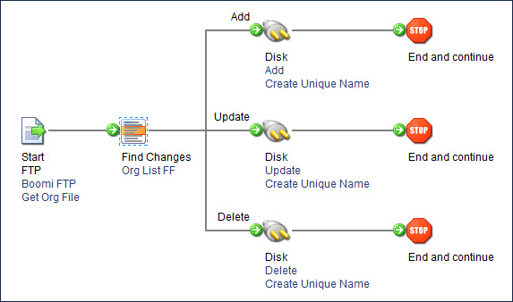

# Find Changes step example

<head>
  <meta name="guidename" content="Integration"/>
  <meta name="context" content="GUID-9a6b06ad-f505-4378-8efa-5d172135b131"/>
</head>

In this scenario, a document is routed according to data changes for a specific flat file profile. This source flat file contains a changing list of client information exported daily from a source system.

The process retrieves the daily file from an FTP directory and finds any changes made per AccountID \(key column\) that is tracked. The resulting records are sent to the associated disk directories so they can be effectively managed by the destination system.

-   Execution 1 — All account records are parsed at the Find Changes step and sent down the Add path as individual documents.

-   Execution 2 — No changes made to the original file. All accounts are parsed and no documents are forwarded down any path.

-   Execution 3 — Three accounts were deleted from the source system and are now missing in the daily flat file dump. All accounts are parsed at the Find Changes step. The three accounts are not found, so the latest capture of these three account records is forwarded as individual documents down the Delete path.

