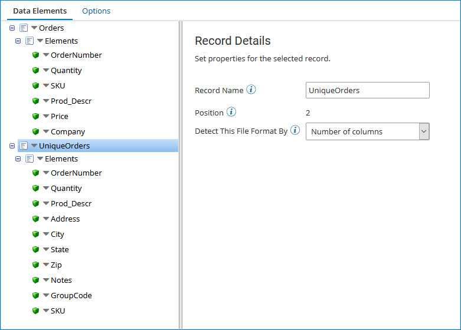
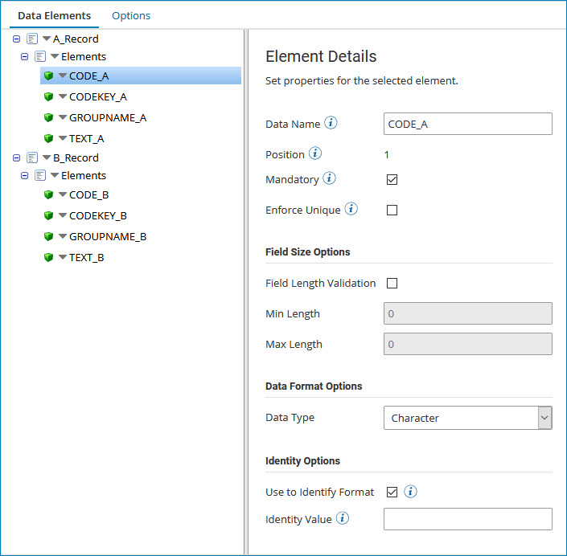
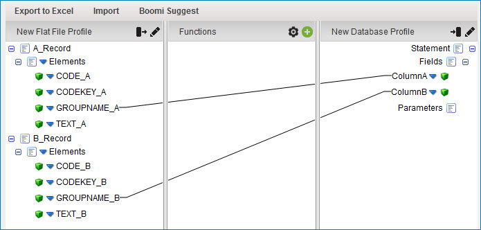

# Flat file record format detection

<head>
  <meta name="guidename" content="Integration"/>
  <meta name="context" content="GUID-efb3a3b3-1aa9-4d22-814d-a8cac523d5d6"/>
</head>


The record format is configured on the record node and is determined either by the number of columns or by a specified unique value in the "Identity Value" element.

The sample data set below contains two record formats, each with a different number of columns. The first and third lines have six columns, whereas the second and fourth rows have 10 columns.

```
Order573*20*376f972*Ntwk Adpt*29.99*Company A
UniqueOrder675*40*Wireless Card*801 Cassatt Road*Berwyn*PA*19312*Call Tech Support Immediately*97G45E*sku4513
Order574*10*5247rt*Headphones*15.75*Company B
UniqueOrder676*25*Wireless Card*Address Unknown*NA*NA*NA*Call Tech Support Immediately*97G45E*sku4513
...
```



The sample data set contains two record formats. Although both have four columns, the first column contains a value that identifies the type of record \(either "A" or "B"\).

```java
A,KEYN9R,5790,BATCH 5212
A,KEYN9R,5791,BATCH 5215
A,KEYN9R,5792,BATCH 5218
B,DZNP7T,4752,BATCH 4759
B,DZNP7T,4753,BATCH 4761
B,DZNP7T,4754,BATCH 4763
```

In the profile, the first element of each record format is configured to Use to Identify Format and the Identity Value of "A" or "B" is specified, respectively.



In a Map component, the multiple record formats configured in the Profile are available to map to and from.

