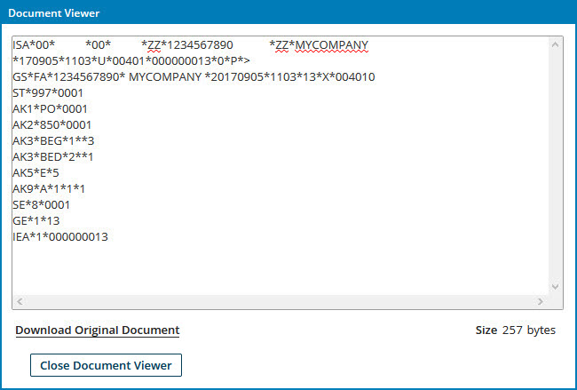

# Inbound EDI document validation and acknowledgment 

<head>
  <meta name="guidename" content="Integration"/>
  <meta name="context" content="GUID-1326eb05-9087-4af4-b510-457291d1675d"/>
</head>

The Trading Partner Start step validates documents in an inbound transmission by comparing the document data against the segment and element configuration specified in a referenced EDI profile for that document type, including mandatory fields, data types, minimum/maximum lengths, and for segments in X12, EDIFACT, and ODETTE documents, validation rules. The option to disable qualifier validation exists for X12, EDIFACT, HL7, and ODETTE document types.

For X12, EDIFACT, HL7, and ODETTE transmissions, If the trading partner used in the Start step is configured to generate acknowledgment messages, validation errors are reported in those messages. For RosettaNet transmissions, the Trading Partner Start step generates acknowledgment messages, in which validation errors are reported, regardless of the trading partner configuration.

In a trading partner component, the **Document Types** tab is used to select the document types exchanged with that trading partner and for each selected document type, select the corresponding profile and set acknowledgment options.

:::note

Documents, Errors, and Acknowledgments paths are attached to the Trading Partner Start step in a process.

-   Attach steps to the Documents path to define the processing to perform on valid documents.

-   Attach steps to the Errors path to define the processing to perform on invalid X12, EDIFACT, HL7, ODETTE, and RosettaNet documents. For EDIFACT, ODETTE and HL7 documents, the Errors path is used only if **Invalid Inbound Document Routing** is set to Errors path for the document type in the Trading Partner Document Types tab.

-   Attach steps to the Acknowledgments path to define the routing of generated acknowledgment messages.

:::

:::note

If a trading partner is configured to use the AS2 communication method, the Request MDN \(Message Disposition Notification\) option can be selected a means of acknowledging successful delivery of a message and reporting errors from that message.

:::

## X12 standard 

With one exception, invalid documents in an X12 transmission are sent to the Start step’s Errors path. In addition, the result of validation of an individual document in a transaction set is captured as the “Is Valid Message?” document property. The “Is Valid Message?” document property location is **Document Property** \> **Trading Partner Information** \> **X12** \> **Transaction Set** \> **Is Valid Message?**. However, if qualifier validation is enabled, otherwise valid documents with invalid qualifiers are sent to step’s Documents path with an acknowledgment status of “Accepted with Errors”.

Functional and interchange acknowledgment message generation options are available in trading partner components.

-   If the trading partner used in a Trading Partner Start step is configured with **Functional Acknowledgment Options** set to either Acknowledge Functional Groups or Acknowledge Transaction Sets, when the process executes, Functional Acknowledgment \(FA\) messages are generated.

    -   If the Acknowledge Functional Groups option is selected, FA message generation occurs at the functional group level.

        If one or more transaction sets in a functional group is invalid, the “Is Valid Message?” document property is set to false for all transaction sets in that functional group.

    -   If the Acknowledge Transaction Sets option is selected, FA message generation occurs at the transaction set level.

        If a transaction set is invalid, its “Is Valid Message?” document property is set to false.

    997 FA messages are generated by default, However, for an individual transaction set, there is an option to instead use 999 FAs. This option is generally used with healthcare-related transaction sets \(X12 version 5010 and higher\).

    FA messages are generated with AK2 and AK5 segments. 997 FA messages may also have AK3 and AK4 segments. 999 FA messages may also have IK3 and IK4 segments. For example, this is a 997 FA message:

    

    AK3 segments in 997 FA messages and IK3 segments in 999 FA messages report segment-level errors. AK4 segments in 997 FA messages and IK4 segments in 999 FA messages report data element-level errors. Failure of a segment to satisfy validation rules configured for that segment in the document profile is reported as a segment-level error and one or more data element-level errors. Each data element-level error identifies an invalid data element and the type of error.

    FAs may be generated with the following validation errors:

    -   Functional Group Trailer Missing.

    -   Group Control Number in the Functional Group Header and Trailer do not match.

    -   Number of Included Transaction Sets Does Not Match Actual Count.

    -   Transaction Set Trailer Missing.

    -   Transaction Set Control Number in Header and Trailer Do Not Match.

    -   Number of Included Segments Does Not Match Actual Count.

    -   One or More Segments in Error.

    -   Missing or Invalid Transaction Set Identifier.

    -   Missing or Invalid Transaction Set Control Number.

    -   Unrecognized segment ID.

    -   Mandatory segment missing.

    -   Segment Has Data Element Errors.

    -   Data element too short.

    -   Data element too long.

    -   Invalid code value.

    -   Conditional required data element missing. \(A validation rule was not satisified.\)

    -   Exclusion condition violated. \(A validation rule was not satisified.\)

-   If the trading partner used in a Trading Partner Start step is configured with the **Use TA1 Acknowledgment** for an individual transaction set, TA1 interchange acknowledgment messages are generated for that type of document to report Interchange-level \(ISA/IEA\) validation results.

    In the Acknowledgments path of the Trading Partner Start step, use the Transaction Set document property to route TA1 acknowledgments.

:::note

GS/GE validations are always done when an acknowledgment is generated.

:::

## EDIFACT standard 

Invalid documents in an EDIFACT transmission are sent to the Trading Partner Start step’s Errors path, provided **Invalid Inbound Document Routing** is set to Errors path for the document type in the Trading Partner Document Types tab. If the EDIFACT trading partner used in the Start step is configured with **CONTRL Acknowledgement Options** set to Acknowledge, when the process executes, acknowledgment messages are generated.

## HL7 standard 

In an HL7 trading partner used in a Trading Partner Start step, accept and application acknowledgment message generation are conditional. For each type of acknowledgment, you can configure the trading partner to always enable acknowledgment message generation or enable it only for valid or invalid individual transmissions.

Invalid documents in an HL7 transmission are sent to the Start step’s Errors path, provided **Invalid Inbound Document Routing** is set to Errors path for the document type in the Trading Partner Document Types tab. In addition, the result of validation is captured as the “Is Valid Message?” document property. The “Is Valid Message?” document property location is **Document Property** \> **Trading Partner Information** \> **HL7** \> **Message** \> **Is Valid Message?**.

## ODETTE standard 

Invalid documents in an ODETTE transmission are sent to the Trading Partner Start step’s Errors path, provided **Invalid Inbound Document Routing** is set to Errors path for the document type in the Trading Partner Document Types tab. If the ODETTE trading partner used in the Start step is configured with **CONTRL Acknowledgement Options** set to Acknowledge, when the process executes, acknowledgment messages are generated.

## RosettaNet standard 
A Trading Partner Start step used with a RosettaNet trading partner generates acknowledgment messages. Invalid documents in a RosettaNet transmission are sent to the Start step’s Errors path.

## Tradacoms standard 

The Tradacoms standard does not include acknowledgments.