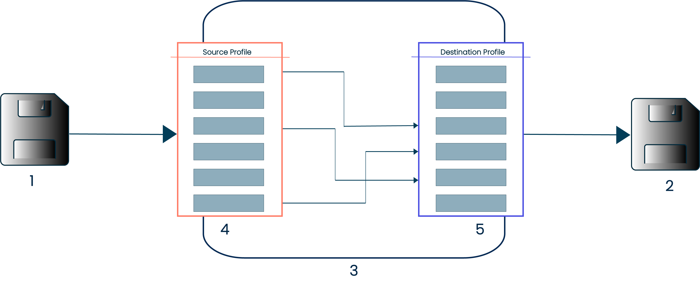

# Map components

<head>
  <meta name="guidename" content="Integration"/>
  <meta name="context" content="GUID-87f669d6-4999-445f-9f29-ed24e79c92dd"/>
</head>

Use maps to convert data from one layout or format to another.

On the map, there are columns for Source and Destination profiles. You can drag and drop fields from the **Source Profile** into the **Destination Profile** to indicate how to move the data. You can also add *functions* to data maps, which allows complex conversion logic to the data when it is moving from source to destination.

In the diagram above:

- 1 is the document as it is currently laid out \(i.e. the input\).

- 2 is the document as you would *like* it to be laid out \(meaning, the output\).

- 4 is the **Source Profile**, which describes the layout of your input.

- 5 is the **Destination Profile**, which describes the layout of your output.

- 3 is the map, a graphical representation of how the fields in your source profile need to be mapped to your **Destination Profile**.

These rules apply when connecting source and destination elements:

- Source Profile Elements — You can make multiple connections from a source element to multiple functions or destination elements.

- Functions — You can use multiple data elements as input for a function. You can create multiple connections from the output of a function. You can configure the order in which functions run.

- Destination Profile Elements — Make only one connection from a source element or function to a destination element.

:::note

You can make multiple connections from a source element to any number of functions or destination elements, however each destination element can only have a single connection to prevent value conflicts.

:::

You can also use Boomi Suggest to map elements for you. Boomi Suggest offers mapping suggestions based on thousands of mappings logged by the community. Each account has the Boomi Suggest feature enabled on the Setup page on the Account Information tab. If you are not happy with the **Suggest** mappings, you have the option to **Clear all mappings** and start over.

You can use default values in maps in two ways:

- If mapping a source element to a destination element with a default value, using the default value occurs only when the source value is null or blank.

- If a mapping to a destination element does not contain a source element, it always uses the default value.

:::note

Some types of maps are extensible, so that you can:

- Define extensions for maps having XML and flat file profiles to override field-to-field mappings when deploying a process.

- Define extensions for maps having flat file profiles to add fields to profiles when deploying a process.

For flat file profiles, the extension methods described above are applicable only to profiles having single-record formats.

For more information about map extensions, see the topics Defining Process Extensions and Data Map Extensions linked in the **Related Concepts** table.

:::

Here are some suggestions for creating maps:

- Ensure that you configure repeating elements to loop in the profile configuration, especially XML profiles.

- To reformat dates, configure the source and destination profile elements as a Date and Time type and specify a date mask. Then map the two fields without a date format function. The date value reformats automatically. The same applies for Number types.

- Start by mapping the minimum number of required fields and follow these guidelines:

  - To determine the required fields, temporarily hard-code default values.

  - To identify mapping problems, unmap fields until you find the field causing the problem.

:::note

You can use the Map Import Wizard to migrate eGate interfaces. The wizard opens when you click the **Import** button, which is visible only to users with write access to the Build page in an account who has HL7 capabilities enabled.

:::
