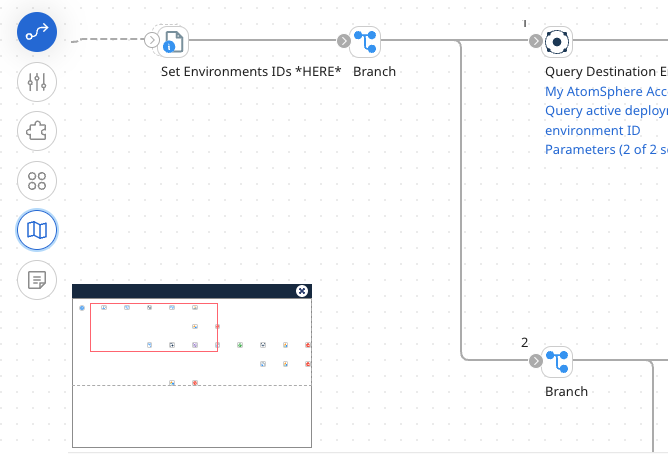
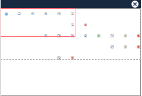

# Navigation palette

<head>
  <meta name="guidename" content="Integration"/>
  <meta name="context" content="GUID-3ea13e08-d1c6-404f-a14b-b90aea9cc9bd"/>
</head>

The navigation palette is a scaled-down view of a process that is optionally available when a process is too large to view in its entirety.

You can view a navigation palette on the canvas by clicking the **Navigation** icon (). By default, the navigation palette opens in the lower left corner of the canvas.

The navigation palette allows you to:

-   See the entire process

-   See where you are located in the process

-   Quickly and easily move to a specific point in the process

Your current location in the process is indicated by a red rectangle. The red rectangle contains everything that is currently visible on your canvas.

When you drag or click in the navigation palette, you change your location on the canvas. This allows you to move quickly to a point on the canvas without having to scroll up and down and left and right until you find the correct location. You can also dock the palette, by dragging it to any of the four corners of the canvas. To close it, click the "x" in its upper right corner or click the Navigation icon again.

Because the process canvas and navigation palette are synchronized, if you make changes or navigate on the canvas you see them on the palette.

The navigation palette is also available in Test mode, which allows you to navigate a process while Test mode is running.
