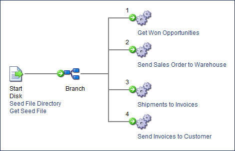

# Process Call step example

<head>
  <meta name="guidename" content="Integration"/>
  <meta name="context" content="GUID-173c5b58-a71b-4b13-baed-5e99f10d45d9"/>
</head>

A great way to use the Process Call step is to coordinate the execution of multiple processes, especially if a process should not execute until one or more prior processes have completed. This is an alternative to carefully setting schedules on each individual process and allowing enough time for execution.

Using the "Wait for process to complete" option guarantees that the first process will finish completely before the next process begins.

There are two basic ways to implement the strategy: either add Process Call steps to the first process in the series or create another "primary" process that simply reads in an arbitrary "seed file" that is used to pass through the process to execute each Process Call step. With either approach you only need to set a schedule on the first or "primary" process.

