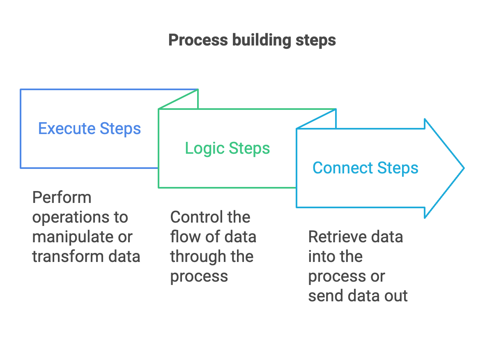
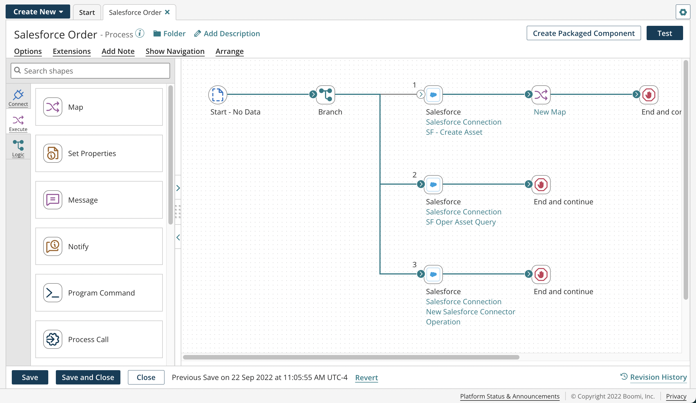

# Process building

<head>
  <meta name="guidename" content="Integration"/>
  <meta name="context" content="GUID-b422a00a-b17b-4ea8-ae01-d04adaf97e16"/>
</head>

Integration uses a graphical interface to represent processes. It provides a large canvas that displays different steps that you can manipulate to create a process. The process is the central component within Integration, representing the path that a document takes from the point at which it is received to when it is sent to one or more destinations.

These steps are contained in a palette to the left of the process canvas.
 
## Adding steps to a process

You can add steps to the process canvas and connect them by:

- Clicking on the  icon that appears at the end of a step.
- Dragging and dropping a step to the end of the dashed line.
By connecting steps, you control how the data flows within the process. Each step performs a specific task on the given data and can place transformed data back into the process for further manipulation.

The image below represents a process on the Build page. The process contains a series of *steps* on the *canvas*.

If you open a process that is too large to view, a navigation palette opens on the canvas automatically.

## Connectors

An Integration process uses a set of [connectors](../Connectors/c-atm-Connectors_bb305b35-0f13-4937-a918-f85dbbe1b27b.md) to collect data from each step. The connectors retrieve and send data to and from various sources and destinations, such as:

- Disk
- Mail
- HTTP
- FTP
- SFTP
- Database
- On-premise or web applications
Connectors also perform various actions on the data they collect using execute steps, logic steps, maps, and map functions.

## Conclusion

Overall, connecting steps on the canvas is the heart of all processes in Integration. Now that you have learned about the pieces and steps, you can use this knowledge to build more complex processes to suit your needs. Go to the build canvas to get started on building your first process. If you need further assistance, contact your Boomi administrator.

## Additional Resources
For more information about this topic, please visit these resources:

- [Building a Boomi Integration](/docs/Atomsphere/Integration/Getting%20started/int-Building_a_Boomi_Integration.md)
- [Integration Workflow](/docs/Atomsphere/Integration/Getting%20started/c-atm-Integration_Workflow_0ff5baa9-222d-4c9a-b97a-982cef8b6d9d.md)
- [Process components introduction](/docs/Atomsphere/Integration/Process%20building/c-atm-Process_components_introduction_b35a1383-169f-41a0-aa15-13a45672b9a2.md)
