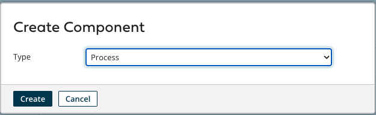
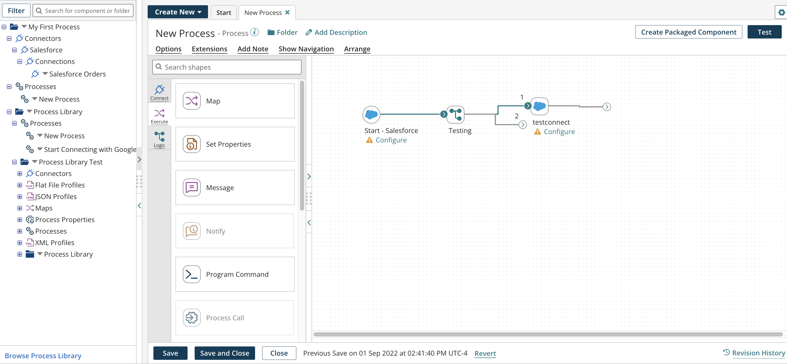

# Process components introduction

<head>
  <meta name="guidename" content="Integration"/>
  <meta name="context" content="GUID-BA7240E4-3968-4FB1-B198-D2F3EC1C775A"/>
</head>

Processes are the central components in Integration. They contain the series of steps that determine how data is executed within the system. A process typically represents a discrete workflow that moves a given type of record from one application to another.

See the Component Overview topic to learn about the different ways to create a process.

After you create a process, it opens in a full-screen view on the process canvas.

The links at the top of the process canvas access these functions:

-   **Options** — Edit process options.

-   **Extensions** — Define extensions for the process. \(Available only if extensions are enabled.\)

-   **Add Note** — Drag and drop sticky annotations on the process canvas.

-   **Show Navigation** — Display or hide the navigation palette, which you can open if the process is too large to view in its entirety.

-   **Create Packaged Component**— Close the component or process on the Build page and navigate to it in the list on the Package Managed Component page \(**Deploy menu** \> **Packaged Components**\). This feature is available only on accounts with the Packaged Component Management privilege.

-   **Arrange** — Automatically align and organize steps, branches, and routes on the process canvas.

-   **Test** — Execute the process in test mode.