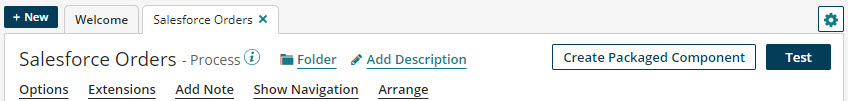

# Process testing

<head>
  <meta name="guidename" content="Integration"/>
  <meta name="context" content="GUID-9108522D-7700-43E8-8DC6-1D6B79241E36"/>
</head>

Test mode allows you to quickly test processes from within the Build page without needing to deploy the process to an Atom.

Test mode is intended to provide immediate feedback on process configuration for use during initial development or production debugging. Test mode provides results and detailed logging information for each step to assist with troubleshooting. To activate test mode, click the Test button when a process is open on the Build page.

:::note

Watch the [Test Mode Enhancements video](http://bcove.me/excxpkk7) to learn about new functionality, retrying previous tests, and reviewing documents in subprocess calls.

::: 

## General considerations

There are a few important things to understand about test mode:

-   When you run a process in test mode, *the process actually runs.* Data actually runs through the process, so records are moved, created, modified, deleted, etc. according to the process configuration.

-   You should run the process in a Test Atom Cloud or install a local Atom on which the process can run during development and testing. The process does not need to be deployed to that Atom.

    :::note

    If you enable environments and test connections in your account and you have test connection licenses, you can deploy processes to a Test Atom Cloud. In that case, test mode limitations do not apply. For more information, see the [Test connection licensing](/docs/Atomsphere/Platform/c-atm-Test_connection_licensing_04708d54-8ea3-453f-8dac-3e2e6b72330b.md) topic.

    :::

-   If you enter test mode and you have made a change to the process without saving it, you receive a message. You can choose to do one of the following:

    -   Revert to and reload the previously saved process. Your recent change will be lost.

    -   Save your recent change and proceed to test mode.

    -   Cancel test mode so that you can continue to work on your recent change.

-   You should test the Start step by itself to verify connection credentials and to verify that the filters and/or criteria you specified are returning what you expect. To view the log entries for a connection in the Start step, you must view the process log.

-   For processes \(or sub-processes within a process\) that include a Process Route component, test mode runs without explicitly deploying the process route or any of its referenced processes.

    Testing a process that includes a process route might result in a longer-than-average initialization time for the first test run. Initialization time is affected by the number of processes and dependent components that must be collected and packaged before testing can begin.

    :::note

    Setting test mode extensions for a process that is called by a Process Route step is not currently supported. Any test mode extensions that you set for a Process Route subprocess are not applied when the parent process is run in Test mode.

    :::

-   When a process runs in test mode, the notifications defined in a Notify step are not sent as email alerts to subscribers.

-   Test mode executions can be filtered for display on the Manage menu's Process Reporting page. However, the log and data files produced during test mode are not accessible in Process Reporting. That information is accessible only within the Build page and is lost once you exit test mode.

## Test mode limitations {#SECTION_7ABBF59AAF5A4DE7B21B4427B2568563 .section}

When you run a process in test mode, the following limitations apply:

-   Test mode is limited to a maximum of 100 files \(documents\) per inbound connector step. If more than 100 files or documents are retrieved by an inbound connector, an error message appears. If this error occurs on the Start step, you have the option to *Retry* just the 100 documents that are originally picked up and forward them through the rest of the process. If this occurs on an inbound Connector step later in the process, you receive a standard error message. You should configure your connector accordingly to process less data for future tests.

    This limitation can be customized for an account for which the enhanced test mode feature is enabled.

    :::note

    The Try/Catch step does not execute auto-retries in test mode, but rather passes the document through to the next step in your process. Process logs will confirm that Try/Catch retry counts were not attempted while in test mode.

    :::

-   Test mode is limited to a maximum aggregate data size of 10 MB across the entire process execution. If the size is exceeded, an error message appears. You should configure filters and/or other selection criteria in the inbound connector operations or profile to limit the size of data read into the process.

    This limitation can be customized for an account for which the enhanced test mode feature is enabled.

-   Test mode does not support real time triggering and therefore cannot be used with listener processes.

-   Test mode does not support parallel processing in the Flow Control step.

## Message generation in test mode 

A limited number of messages are generated when you run a process in test mode. This protects the Atom and platform from being overwhelmed by a huge number of messages resulting from a test execution with numerous errors.

-   By default, the maximum number of messages per process is 5,000. In most cases, your test executions should not generate more messages than this.

-   When a test execution begins to reach the maximum number of messages, the number of log messages is first limited, and then the number of messages related to executing steps is limited. Finally, no further messages are generated. Warning messages appear on the process canvas to notify you that this is taking place.

-   If a test execution can no longer generate messages related to the execution of steps, then it is unknown as to whether those steps executed successfully. The first untested step is highlighted in dark gray. The steps that follow have no highlighting.

-   If the maximum number of messages is reached, you receive a message once the process completes successfully or fails. If this occurs, it is recommended that you review the steps highlighted in dark gray \(indicating that it generated too many messages\) or red \(indicating that they completed with errors\).

-   If the maximum number of messages is reached, the status of each document is still reported in the Documents pane. Successful documents are marked with a green check mark  and documents that encountered errors are marked with a red X .

-   Your system administrator can decrease the maximum number of messages by setting the `com.boomi.container.maxTestMessages` property. This property can be set on the Custom tab in the Properties panel. This number cannot be changed to a number greater than 5,000.

## Enhanced test mode

:::note

Enhanced test mode is an optional account feature. If you would like to have this feature enabled in your account, contact your Boomi representative.

:::

For an account with enhanced test mode enabled, these standard test mode limitations for an Atom, Molecule or Atom Cloud are customizable:

-   Maximum number of files \(documents\) per inbound connector step

    This maximum is specified by the container property TEST\_MODE\_MAX\_DOCS.

-   Maximum aggregate data size across the execution of a process

    This maximum is specified in bytes by the container property TEST\_MODE\_MAX\_BYTES.

To set these properties:

-   For an Atom Cloud’s Molecule or an attached Atom, go to **Manage** \> **Cloud Management**, select the **Attachment Quotas** tab, and then select the Atom Cloud and the Molecule or Atom. Then edit either or both of the **Test Mode Maximum Document Count** and **Test Mode Maximum Aggregate Document Size** fields.

-   For a local Atom or Molecule, open its container.properties file in a text editor, edit the value of either or both of the `com.boomi.container.config.quota.TEST_MODE_MAX_DOCS` and `com.boomi.container.config.quota.TEST_MODE_MAX_BYTES` property definitions, and restart the Atom or Molecule.

To remove these limitations, specify negative values.