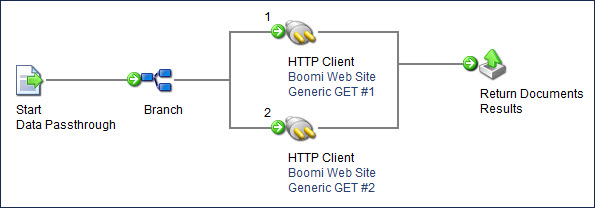

# Return Documents step example

<head>
  <meta name="guidename" content="Integration"/>
  <meta name="context" content="GUID-23e80892-ff33-4392-a486-13ba7275c898"/>
</head>

The Return Documents step reacts differently when compared to other process steps in regards to flow execution. No matter how many different paths need to finish throughout the course of an execution, the *Return Documents* steps "wait" until all possible documents reach the step and then returns the documents accordingly via one of the use cases above. Instead of returning documents one by one to the source calling point, the step batches all documents first.

The example below describes a case where this is useful so you can pause the processing for specific data scenarios.

Assume that you need to use the HTTP Client connector multiple times within a process with different operations. Each time it executes it retrieves a different data type. Normally, the returned files go down each path after the connector uniquely and are outputted to a destination as single documents.

You can use a child process call in order to gather all of the relevant data together. With this call, it is possible to retrieve files from multiple sources and then "wait" for them in the parent process.

Here are the general steps to follow to build this type of process:

1.  Build the child process that gets multiple files via the HTTP Client Connector. The process should begin with "Data Passthrough" defined in the Start step.

2.  Immediately after the Start step, add a Branch step with the number of branches equal to the number of files that you want to get.

3.  On branch 1 add a Connector step that does an HTTP GET. This retrieves the file from the web site.

4.  After the Connector step, attach it to a Return Documents step that is labeled with an informative name, such as "Results".

5.  On branch 2 add a Connector step that does an HTTP GET for the other file.

6.  After the Connector step, attach it to the same Return Documents step.

7.  Save and close the process. \(Or you can run the process in Test mode to make sure that it successfully retrieves the files\).

    

8.  Create a primary process and set the Start step to use "No Data".

9.  Immediately after the Start step, add a Process Call step and select the child process.

    Once selected, a line appears coming out of the Process Call step with the label of the Return Documents step in the child process Call \(in this case, "Results"\). This line contains your combined results.

10. Now you can run a process to combine the files and send them to the proper destination.

    

11. You must deploy the processes to an atom in order to test the functionality of the Return Documents step. The Return Documents step is not available in Test mode. Review the Connection Licenses topic to ensure that you can deploy effectively.