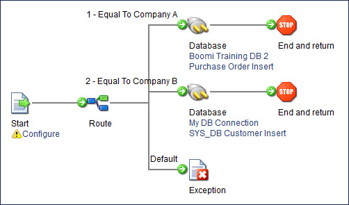

# Route step example

<head>
  <meta name="guidename" content="Integration"/>
  <meta name="context" content="GUID-b78f5f9f-54d0-4d16-8fd2-917b2f913857"/>
</head>

In this scenario, an inbound document is routed according to the trading partner.

For example, a company has two trading partners, A and B. If trading partner A sends a document, it is automatically routed to a specified map or connector according to the settings in the Route step. If trading partner B sends a document, it is automatically routed to a specified map or connector according to the settings in the Route step. If trading partner C sends a document, the file is routed down the default path and can go to a Stop step or an Exception step with an error message.

