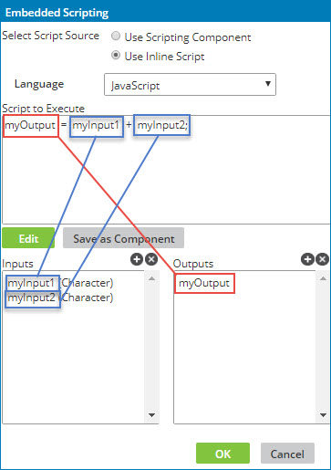

# Script inputs and outputs

<head>
  <meta name="guidename" content="Integration"/>
  <meta name="context" content="GUID-7596e4a1-fe86-4491-a3b6-f5a67cc81645"/>
</head>

The main objective of the script is to take the input values passed into the function and then perform one or more calculations, transformations, conditional logic, etc. based on those values in order to set appropriate values for the output\(s\) to be mapped out of the function.

There are several important concepts to understand about inputs and outputs:

-   *The inputs and outputs are variable declarations.* Your script should reference them as if they were already declared at the beginning of the script. Do not declare them again within your script. Make sure the variables used in the script match the input and output names exactly.

-   The mapping engine sets values for the inputs based on the elements you have mapped to them.

-   It is the responsibility of your script to set values for the output\(s\). If you do not assign a value to the output variable, no value is passed out of the function.

-   You can explicitly define the input data type. This instructs the mapping engine to "cast" the input value as an object of that type for your script to use. Unless you are specifically performing date or numerical operations, it is recommended to leave the data type as Character.

-   You do not explicitly define the output data type. The data type is inferred by the scripting engine based on the value assigned to the output variable.

-   Input and output names are entirely arbitrary.

-   Input and output names must be valid variable names for the given language. Typically this means they cannot contain spaces or special characters and cannot begin with a number.

-   Character-type input values are never `null`. If the source data is null, blank or empty, or omitted altogether, the value passed into the script for that input is an empty string \(""\). This means if you want to check if a value is populated, your script need only check if the value is not empty. However date-, integer-, and float-type input values can be `null` so your script should check for nulls before operating on that value. \(This is because the value is actually passed into the script as a date, integer, or float *object*.\)

- Float-type input values are double-precision binary floating point. Values exceeding storage capacity are rounded.

