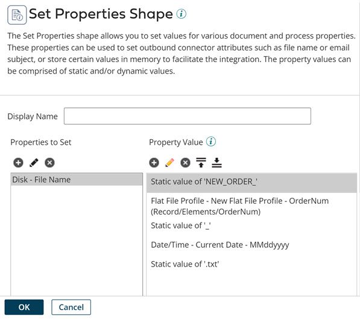

# Set Properties step example

<head>
  <meta name="guidename" content="Integration"/>
  <meta name="context" content="GUID-054c3544-72d5-4e05-84b0-9b74a6367458"/>
</head>

You can use multiple parameters to create complex dynamic values for file names or directories.

For example, to write data out to disk with the following file naming convention:

`NEW_ORDER_<ordernum>_<current timestamp>.txt`

You can use the Set Properties step to dynamically set the disk file name with five parameters like this:

The parameters are:

-   Parameter 1: Type=Static, Static Value="NEW\_ORDER\_"

-   Parameter 2: Type=Profile Element, choose the appropriate profile type, profile, and element

-   Parameter 3: Type=Static, Static Value="\_"

-   Parameter 4: Type=Date/Time, Date Mask="MMddyyyy", Date Type=Current Date

-   Parameter 5: Type=Static, Static Value=".txt"