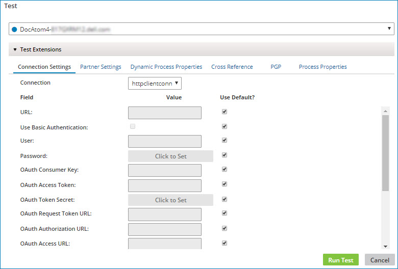

# Extension values for use in Test mode

<head>
  <meta name="guidename" content="Integration"/>
  <meta name="context" content="GUID-a3aa3a4a-03b7-488c-b70c-f145af642897"/>
</head>

To assist with testing, you can configure values for Connection and Process Property extensions when executing the process in Test mode.

Test mode extension values are remembered per Atom. That means if you reopen the process at a later time and select the same Atom, you do not need to reconfigure the extensions. However, you do need to configure the extensions for each process. For example, if you have two processes that use the same FTP Connection component, you need to configure the same FTP settings for that connection when running each process in Test mode.

:::note

Setting test mode extensions for a process that is called by a Process Route step is not currently supported. Any test mode extensions that you set for a Process Route subprocess are not applied when the parent process is run in Test mode.

:::

