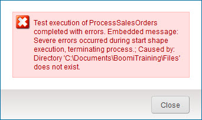

# Troubleshoot test mode

<head>
  <meta name="guidename" content="Integration"/>
  <meta name="context" content="GUID-e6391c89-f6b0-441b-9cf7-722afac3cc5f"/>
</head>

When an error occurs during test execution, you may have an error message or need additional information in the process and document logs.

Inbound documents that were processed successfully are marked with a green check mark  and each of its process steps is highlighted in green.

Documents that encountered errors are marked as failed with a red X  and one of the process steps is highlighted in red.

If an error occurred during the execution, a dialog displays an error message.

For more information, view the process log and/or document logs by selecting the failed document and then clicking the process step highlighted in red. In the log, look for the entry section marked as SEVERE, then click the Details link for more information. Depending on the error type, you may need to review the inbound data to look for bad data or exit Test mode and modify the process configuration.