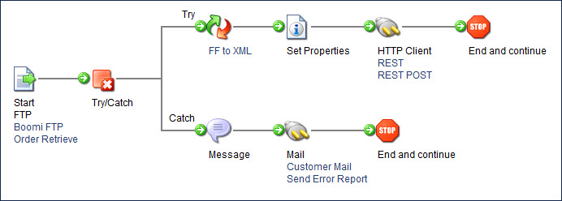
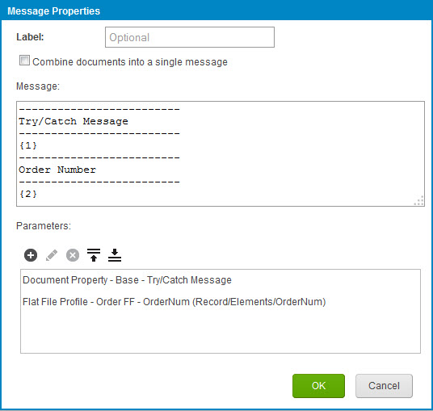
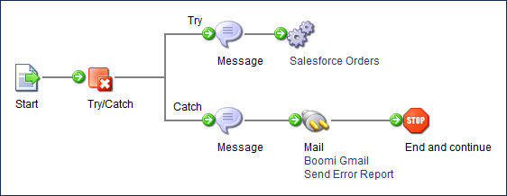

# Try/Catch step examples

<head>
  <meta name="guidename" content="Integration"/>
  <meta name="context" content="GUID-867b8cc6-dfbc-49ac-b33e-cd803d75151a"/>
</head>

The process described in this topic demonstrates a use case of the Try/Catch step. The step has been added to the process to track any errors for a given document \(the **Failure Trigger** field is set to Document Errors\) and send the failed, source document down the Catch Error path. The failed document \(HTTP Client Error\) is sent down the Catch Error path as flat file data because the Try/Catch step is positioned *before* the Flat File to XML map.

The Try/Catch step is intended to forward the original document \(that failed\) down the Catch Error path. To reference the error message for the failed document, you must use a Document Property parameter lookup \(**Document Property** \> **Meta Information** \> **Base** \> **Try/Catch Message**\). You commonly add this parameter value to a Message or Notify step to report the failure to users.

The Message step includes a Document Property reference to identify the error that occurred when sending the XML data through the HTTP Client connector. In the message, you can also add a Flat File Profile Element parameter lookup to identify the primary element such as the record ID that failed.

The following process demonstrates how the Try/Catch step works with subprocesses. In this example, the Try/Catch step at the beginning of the parent process captures errors from the subprocess. The Process Call step has the **Wait for process to complete?** check box turned on and the **Abort if process fails?** check box turned off. If the Try/Catch step was in the subprocess, it would capture errors only from the subprocess.

Note that having the Process Call step’s check boxes set differently could change the behavior.

-   If **Abort if process fails?** is off, the Process Call step tracks subprocess failures at the document level and sends them down the Catch path on the parent process.

-   If **Abort if process fails?** is on, the Process Call step tracks subprocess failures at the process level and fails the parent process at the subprocess.

-   If **Wait for process to complete?** is on, the Process Call step waits for the subprocess to complete before continuing. The process call then handles the subprocess call errors according to how the **Abort if process fails?** check box is set.

-   If **Wait for process to complete?** is off, the Process Call step does not wait for the subprocess to complete before continuing. Regardless of the **Abort if process fails?** setting, the errors in the subprocess are not returned to the parent process. The parent process continues and catches errors from the parent process only.