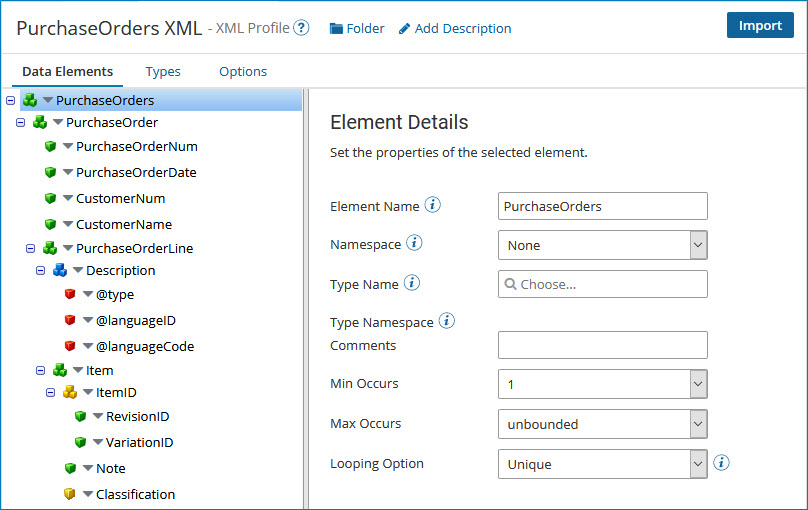
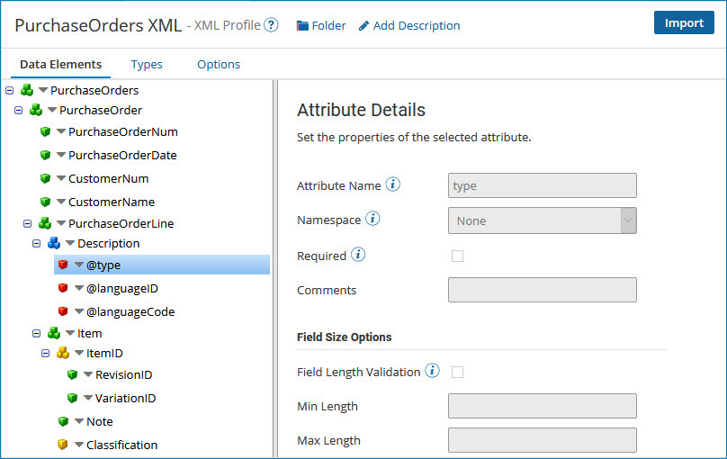

# XML profile data elements

<head>
  <meta name="guidename" content="Integration"/>
  <meta name="context" content="GUID-2c0133dc-0a5d-4b90-abae-43d057619af4"/>
</head>

The XML profile's Data Elements tab displays the actual structure of the XML document.

Because XML is a hierarchical structure, the elements, attributes, and their relationships are represented in a tree structure. Element names in the XML profile need to match the XML document’s element and attribute names exactly. The application uses this configuration to know how to read and write the XML document.

Every XML profile has exactly one root element. All other elements are contained within this single root element. Elements can be *nested* within another element to establish parent/child relationships.

The icons in the tree structure on the Data Elements tab represent the following:

-    An element without elements or attributes

-    An element that has elements and/or attributes

-    An attribute

-    An element that references a complex type without elements or attributes

-    An element that references a complex type that has elements and/or attributes

-    An element that references an element declaration without elements or attributes

-    An element that references an element declaration that has elements and/or attributes

If you select an element in the tree on the left its settings appear on the right.

If you select an attribute in the tree on the left, its settings appear on the right.

