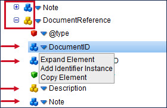
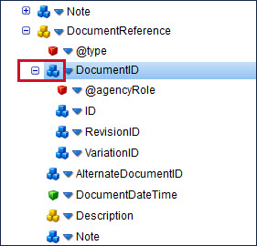

# XML profiles

<head>
  <meta name="guidename" content="Integration"/>
  <meta name="context" content="GUID-965dfb3e-4a62-44cc-a2fe-907583101bca"/>
</head>


XML profiles represent the structure of the various XML documents used within processes, including all the elements, attributes, complex types, looping, and other configuration information.

XML \(Extensible Mark-Up Language\) is a self-describing format that uses tags or *elements* \(`<tagName>value</tagName>`\) to delimit and organize data. The XML format is often used to send data over the Internet, especially when communicating with web applications via web services. Many connectors automatically generate XML profiles for you to use with various operations. However, if you have a proprietary XML structure you can build an XML profile from scratch.

:::note

New to XML? Check out W3 School's [online tutorial](http://www.w3schools.com/xml) or the [W3C XML Specification](http://www.w3c.org/XML).

:::

## XML Profile Import wizard

You might need to work with a proprietary XML format other than the ones required by the service connectors. If you do, you can use the Import Wizard to automatically generate the profile from an XML Schema Definition \(XSD file\), a sample XML file, or a RosettaNet schema.

## Complex types and element declarations

XML profiles that you create, or XML Schemas \(XSD files\) that you import, can contain elements that reference complex types and/or element declarations.

-   A [complex type](https://www.w3schools.com/xml/el_complextype.asp) is a type definition for elements that can contain attributes and elements. Complex types are useful because once you define them, other elements with the same characteristics can refer to them through their Type attribute. This allows you to define one complex type and reference its definition multiple times. Complex types more accurately represent the structure of XSD files. Complex types are represented by yellow building block icons in the tree structure on the XML profile’s Data Elements and Types tabs: elements without elements or attributes  or elements with elements and/or attributes .

-   An *element declaration* associates a name with a type definition, which can be a built-in data type, a simple type, or a complex type. You can use element declarations to validate element information item values by using a type definition, and to specify default or fixed values for element information items. Element declarations are represented by blue building block icons in the tree structure on the XML profile’s Data Elements and Types tabs: declarations without elements or attributes  or declarations with elements and/or attributes .


You can create XML profiles that use or do not use complex types and element declarations. XML profiles created prior to the September 2013 release do not contain complex types or element declarations. You cannot reference complex types or element declarations in those XML profiles, unless you import an XSD file into the profile.

Complex types and element declarations that have child elements and/or attributes are represented by icons showing three building blocks:  or . These complex types and element declarations might or might not be expanded in the tree structure. If a complex type or element has already been expanded, the icon has three building blocks and there is a plus \(+\) or minus \(-\) button next to it. You can click the plus or minus button to expand or collapse the complex type or element.



If a complex type or element has not yet been expanded, the icon has three building blocks but there is no button next to it for expanding or collapsing \(as shown by the arrows in the image above\). If you click the blue arrow next to the icon, you can select Expand Element. Once you expand a complex type or element, it has a minus button next to it. Now you can collapse and expand it.



Complex types can be non-recursive or recursive. Top-level, non-recursive complex types are expanded when you import an XSD file. You can expand their children as needed. Recursive complex types are not expanded by default. Expanding a complex type or element declaration creates additional XML profile elements. You can decide which complex types and element declarations to expand in the XML profile. If your map contains a complex type whose child elements need to be mapped, you would expand that element, for example.

## Instance identifiers and constraints

XML profiles created as of the September 2013 release or later use instance identifiers rather than constraints. Instance identifiers can be based on occurrence or qualifier. Therefore when you create new XML profiles you see options for adding instance identifiers and qualifiers. XML profiles created prior to the September 2013 release continue to use constraints. It is recommended that you use instance identifiers rather than constraints in order to improve performance and to use less memory.

## Implicit ordering

If an XML profile contains multiple peer elements with the same name \(as shown below\) and no instance identifiers or qualifiers, the peer elements will be considered to be implicitly ordered \(constrained by index\). This provides better mapping, processing speed, and memory usage.

```
<root>
<element1>
<child1>value1</child1>
<child2>value2</child2>
</element1>
<element1>
<child1>value3</child1>
<child2>value4</child2>
</element1>
<element1>
<child1>value5</child1>
<child2>value6</child2>
</element1>
</root>
```

## Copying Elements and Attributes

You can copy and paste elements and/or attributes in XML profiles. This saves you time when creating or updating XML profiles. Here are the rules for copying elements and attributes:

-   If an element or attribute can be copied, the Copy option appears on its menu.

-   All of the copied element and/or attribute’s properties and settings \(such as its name, namespace, type, field size options, data type options, qualifiers, etc.\) are copied, too.

-   If the copied element has child elements or attributes, they are copied as well.

-   They can be copied to any element that is not read-only. If the destination element can be edited, the Paste option appears when you click its blue arrow .

-   The copied elements and/or attributes become children of the destination element.

-   They can be copied to other editable locations on the Data Elements tab, on the Types tab, or from one tab to the other within an XML profile.

-   They can be copied from one XML profile to another XML profile.

-   The copied elements and/or attributes can be pasted multiple times. They remain in the buffer as long as the source XML profile is open.

-   You cannot copy complex types, element declarations, or namespaces.
