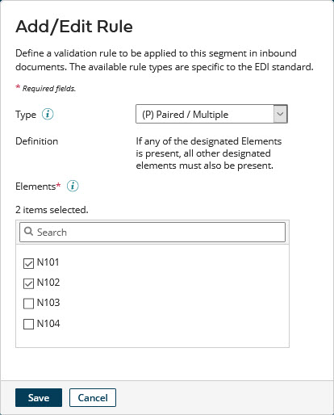

# Adding validation rules to an EDI profile segment 

<head>
  <meta name="guidename" content="Integration"/>
  <meta name="context" content="GUID-30026ae0-02c7-4230-97b8-20f4cca9e7d1"/>
</head>

You can add validation rules to a segment in an EDI profile. Rules can be applied when inbound documents received through the Trading Partner Start step or outbound documents sent through the Trading Partner step are validated against the profile.

## Before you begin

The **Segment Validation Rules** option must first be selected for the proifle in its **Options** tab not only to add rules but also to enable rules to be applied to segments in documents.

## About this task

:::note

Currently you can add validation rules only to segments in X12, EDIFACT, and ODETTE EDI profiles. When segments are imported into an X12 EDI profile, rules defined in the X12 standard for the selected version of the standard are automatically added to the imported segments.

:::

## Procedure

1.  Open the EDI profile.

2.  Select the **Data Elements** tab, expand the tree, and select the segment.

    The segment details appear in the EDI Segment Details panel.

3.  In the Validation Rules section of the panel, click **Add Rule**.

    The Add/Edit Rule dialog opens.

    

4.  Select the rule **Type**.

    These X12 standard rule types are available for selection:

    -   \(P\) Paired/Multiple — if any of a certain set of elements is present in a document, all other elements in the set must also be present.

    -   \(R\) Required — at least one of a certain set of elements must be present in a document.

    -   \(E\) Exclusion — one and only one of a certain set of elements can be present in a document.

    -   \(C\) Conditional — if a particular element is present in a document, certain other elements must also be present.

    -   \(L\) List Conditional — if a particular element is present in a document, at least one of a certain set of other elements must also be present.

    These EDIFACT and ODETTE standard rule types are available for selection. The parenthetical codes — for example, \(D1\) — are specific to EDIFACT.

    -   \(D1\) One and Only One — one and only one of a certain set of elements can be present in a document.

    -   \(D2\) All or None — if any of a certain set of elements is present in a document, all other elements in the set must also be present.

    -   \(D3\) One or More — at least one of a certain set of elements must be present in a document.

    -   \(D4\) One or None — one or none of a certain set of elements can be present in a document.

    -   \(D5\) If First Then All — if a particular element is present in a document, certain other elements must also be present.

    -   \(D6\) If First, Then At Least One More — if a particular element is present in a document, at least one of a certain set of other elements must also be present.

    -   \(D7\) If First, Then None of the Others — if a particular element is present in a document, none of a certain set of other elements can be present.

    If you set **Type** to “\(C\) Conditional”, “\(L\) List Conditional”, “\(D5\) If First Then All”, “\(D6\) If First, Then At Least One More”, or “\(D7\) If First, Then None of the Others”, the **Conditional Element** list is revealed — continue with step 5. Otherwise, skip to step 6.

5.  In the **Conditional Element** list, select the element whose presence or absence in the document will be initially evaluated when the rule is applied.

6.  In the **Elements** list, for each element whose presence or absence in the document will be evaluated or additionally evaluated when the rule is applied, select the element’s check box.

    For example, if you set **Type** to “\(R\) Required”, in the **Elements** list you would select the elements comprising the set from which at least one element must be present in a document.

    You can use the search field to filter the **Elements** list.

    :::note
    
    If you set **Type** to “\(P\) Paired / Multiple” or “\(D2\) All or None”, you would need to select multiple elements in the **Elements** list for the rule to be meaningful when applied.

    :::

7.  Click **Save**.

    Focus returns to the EDI Segment Details panel. In the Validation Rules table, the newly added rule is shown.

8.  **Optional**: For each additional rule you want to add, repeat steps 3–7.

9.  Click **Save** to save the profile.