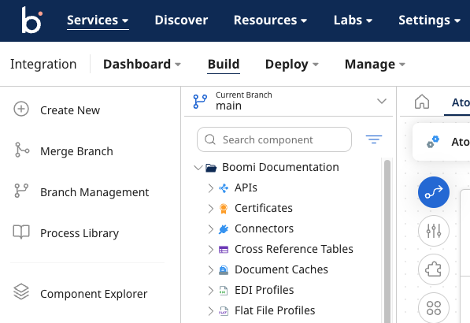
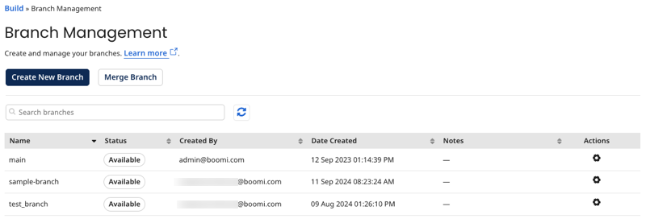
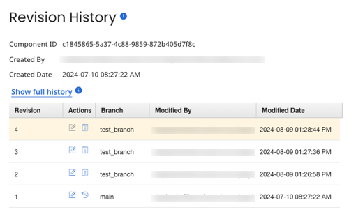

# Parallel Development with Branch and Merge

<head>
  <meta name="guidename" content="Integration"/>
  <meta name="context" content="GUID-60bf9370-02e9-410a-b22a-305413516479"/>
</head>

Boomi's Parallel Development with Branch and Merge feature allows you to create, manage, and merge development branches. This advanced versioning capability not only helps you minimize disruptions to production components, but enables multiple developers to work seamlessly in the same account.

You can manage branches in the Boomi Enterprise Platform or by using the [Branch](https://developer.boomi.com/api/platformapi#tag/Branch) and [Merge Request](https://developer.boomi.com/api/platformapi#tag/MergeRequest) API objects.

## Enable Branch and Merge

Only account administrators can enable the Branch and Merge feature in an account. From the Features page (**Settings** \> **Account Information and Setup** \> **Features**), toggle on the Branch and Merge feature.

:::note

Currently, you cannot disable Branch and Merge after enabling it. You must contact Boomi Support to disable the feature.

:::

After enabling Branch and Merge, you will see the following features in the platform:

- The branch chooser in the Component Explorer
- Branch Management in the left shortcut sidebar or from the branch chooser
- Merge branch option in the left shortcut sidebar

## User roles and privileges

Account administrators can apply the following user roles and privileges to give access to Branch and Merge features:

| Privilege | Description | Administrator Role | Standard User Role |
| --- | --- | --- | --- |
| Branch Create & Modify Access | Create and update branches using Branch Management and the Branch object. Create hotfix branches from the Packaged Deployments page or Deployments page. | Included | Included |
| Branch Delete Access | Delete branches using Branch Management and the Branch object. | Included | Included |
| Build Read Access | Read access to Branch Management, all branches, and all components and processes within branches. | Included | Included |

## Branch chooser

The branch chooser displays your current working branch above the Component Explorer. Click the arrow to see and search your existing branches or open Branch Management. When you change branches, the Component Explorer refrehes to show only the components that are in the current branch.

## Branch Management

You can access Branch Management from the left shortcut sidebar or from the branch chooser. In Branch Management, you can view all available branches in the account, their current status, and make modifications to any branch. You can also create a merge request between branches.

- **Name** - Branch name
- **Status** - Branch status. Possible values are:

  - *Available* - Ready to use
  - *Pending* - Branch is being created
  - *Merging* - Branch is being merged

- **Created By** - The user who created the branch
- **Date Created** - The date and time that the branch was created
- **Notes** - Any notes entered when the branch was created
- **Actions** - The action icon provides the options to **Edit**, **View Merge Requests**, **Set as default**, or **Delete**

:::note

You cannot edit or delete the main branch.

:::

## Component revision history

The revision history includes all revisions to a component for the current branch. You can view the component's full history across all branches by clicking **Show full history**.

## Hotfixes

A hotfix branch is a special branch created from a packaged component, either directly or through a deployment. Hotfixes are intended to fix a specific issue and to be created and merged quickly. You can filter by hotfix component in the Component Explorer to see all components that are included in a hotfix branch.

:::note

Hotfix components will show in the filter for hotfix branches created only after the November 2024 Platform release.

:::

To learn more about creating hotfix branches, refer to [Creating branches](./int-Creating_branches.md).

## Next steps

- [Creating branches](./int-Creating_branches.md)
- [Merging branches](./int-Merging_branches.md)
