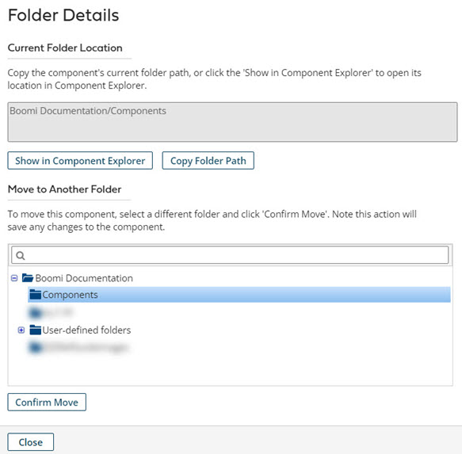

# Viewing and moving Components to a new folder

<head>
  <meta name="guidename" content="Integration"/>
  <meta name="context" content="GUID-6a08d25e-f8ff-4f63-9af4-4a4e8a443158"/>
</head>

Use the component's **Folder Details** dialog to view and copy the component's folder path or move the component to a new folder in Component Explorer. You can access the **Folder Details** dialog from an opened component on the Build tab.

To open the **Folder Details** dialog, on the Build page, click the **Folder** link at the top of an opened component or process.

## View current folder location

Use the **Show in Component Explorer** button to open the component's current folder location in the Component Explorer hierarchy. The window in the **Folder Details** dialog also lists the component's folder path in Component Explorer, which you can copy using the **Copy Folder Path** button for sharing with other users.

## Move to Another Folder

:::note

You must have the Build Read and Write access role to move components. This action does not display for users with Build Read Access privileges or insufficient folder permissions.

:::

In the **Move to Another Folder** portion of the **Folder Details** dialog, the highlighted selection represents the current folder where the component resides. You can move the component to a new folder by selecting a different folder and clicking **Confirm Move**. Commit any unsaved changes made to the component before proceeding. The **Confirm Move** action changes only the folder location of the parent component; child components remain unaffected during a folder move.

Alternatively, you can create and select a new folder location when copying and moving folders and components. Click the plus \(+\) symbol to create a new folder.