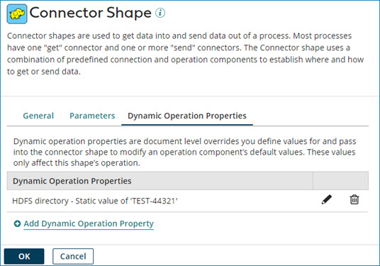

# Connector step dialog, Dynamic Operation Properties tab

<head>
  <meta name="guidename" content="Integration"/>
  <meta name="context" content="GUID-e473feba-b349-4b3b-8d82-2c3c9f94469b"/>
</head>

Some connectors enable you to define dynamic operation properties, which are document-level overrides that you define values for, and pass them into the Connector step to override the operation component's default value. The Connector step dialog's **Dynamic Operation Properties** tab allows you to provide static values or document-level values \(Document Property\) for the parameters. You can add, edit, and delete the parameters.

The dynamic operation property values defined only affect the specific step's operation that is selected on the **General** tab in this dialog.

:::info Important

If the **Dynamic Operation Properties** tab does not appear in the Connector step, the feature to display the tab is not enabled by the developer. To learn more, see the topic [Connector descriptor file](https://developer.boomi.com/docs/Connectors/GettingStartedWithConnectorDevelopment/ConnectorArchitecture/Connector_descriptor_file). Other connectors, for example Hadoop and Google Sheets, have the feature enabled and the **Dynamic Operation Properties** tab automatically appears.

:::

**Add Dynamic Operation Property** -   
Click to display the **Parameter Value** dialog and specify one of the following:

  -   Dynamically overriding the operation value with a static value:
  -   **Type** — Select Static in the drop-down list and provide a static value in the **Static Value** field. Upon process execution, the static value provided takes precedence and is used instead of the value set in the operation.
    -   Dynamically overriding the operation value with a document-level value \(Document Property\):
  -   **Type** — Select Document Property in the drop-down list and browse for the document property in the **Document Property** field. Upon process execution, the selected property takes precedence and is used instead of the value set in the operation.

#### Example: Dynamically passing a File Name to the Hadoop connector

You want to dynamically pass the File Name from the Disk V2 connector's output documents to the corresponding field in Hadoop. Select File Name in the **Input** drop-down list, choose Document Property for **Type**, and browse for the Disk V2 connector's File Name document property.