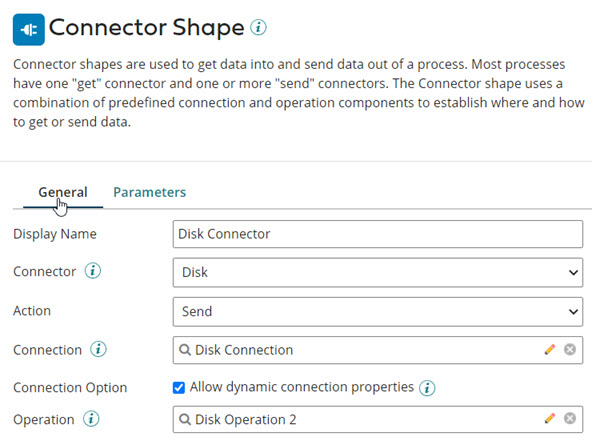
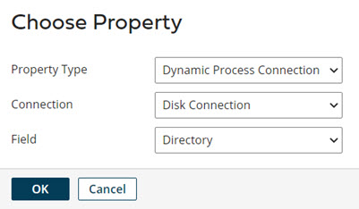

# Creating dynamic process connections

<head>
  <meta name="guidename" content="Integration"/>
  <meta name="context" content="GUID-59f6fbfa-231b-4596-8fd2-c21f0a4809df"/>
</head>

Learn how to set dynamic process connections for use at runtime via the Set Properties and Connector steps.

## About this task

:::info Important

Due to the wider implications of how this feature impacts connector licensing, this feature is currently provisioned only for select accounts. Please contact your Platform account representative for information about how to enable this feature for your account.

:::

[Dynamic Process Connection properties](int-Dynamic_Process_Connection_properties_9067300c-3df3-40ba-97b3-5a6a03a3a6dc.md) are used to override Connection and extension-level values at runtime, allowing you to dynamically set connection values per Connector step as needed. To set dynamic process connections, you need to configure settings in both the Set Properties and Connector steps within your process, as described in the steps below.

Because processes can be configured in a variety of ways to support different patterns, these steps are general guidelines for setting dynamic process connections using the Set Properties and Connector steps. Your finished process design will likely use other steps not mentioned here.

## Procedure

1.  In the service, create a new process or open an existing process in the Build tab.

2.  Add a **Connector step** to the process.

3.  On the Connector step, turn on the **Allow dynamic connection properties** option and then click **OK** to exit the Connector step.

    

4. **Optional:**  If you have not already done so, configure the **Connection** component for your Connector by populating all its available field values according to your particular use case. Once you are finished configuring the Connection, click **Save and Close** on the component.

5.  Next, add a **Set Properties step** to the process.

    :::note
    
    In order for Connection fields to be overridden by dynamic credentials at runtime, the Set Properties step must come before the affected Connector step\(s\) in your process design.

    :::

6.  On the Set Properties step, click the  \(**Add Property**\) button in the Properties to Set column.

7.  In the **Property Type** field on the Choose Property dialog, select **Dynamic Process Connection Property**.

8.  In the **Connection** drop-down, choose a Connection component containing the field you wish to override with dynamic credentials.

    :::note

    The **Connection** drop-down lists all Connection components that you have configured in the process.

    :::

9.  In the **Field** drop-down, choose a specific field you wish to override with dynamic credentials, then click **OK** to close the dialog.

    

10. On the Set Properties step, select the new Dynamic Process Connection Property you created, and click the  \(**Add Parameter**\) button in the Parameters column.

11. In the **Parameter Type** field, select a parameter type and then configure the parameter. Click **OK**.

12. Click **OK** to close the Set Properties step.

## Results

If the same Connection component is used multiple times within a process, the **Allow dynamic Connection properties** option must be enabled on each of the Connector steps. If this is not set, the same Connections are executed with varying values at different points in the process. Once you configure both your Connectors and Set Properties steps according to these steps and save the process, your connections are successfully overridden at runtime.