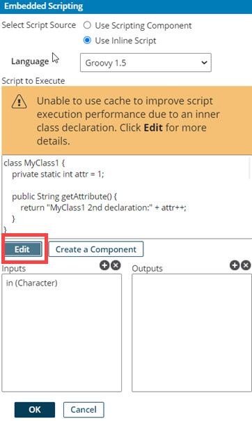
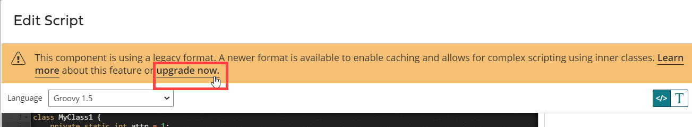

# Enabling caching on a custom Groovy script

<head>
  <meta name="guidename" content="Integration"/>
  <meta name="context" content="GUID-9a8c0335-5bb4-4058-8834-5dce1614113c"/>
</head>

Learn how to optionally upgrade a legacy custom scripting function to enable caching and allow for more complex scripting capabilities.

If your custom scripting function runs on a legacy format and you wish to provide custom inline script, you have the option to upgrade the function to a newer format which enables caching. A custom scripting function is considered legacy if the script:

-   uses Groovy v2.4, or Groovy v1.5 syntax
-   contains inner class declaration
-   was created prior to the July 2021 release

By upgrading your scripts to enable caching, you can apply more complex scripting such as inner class declaration. Use the following steps to upgrade your custom Groovy scripts:

1.  In , locate and open the Map component containing the custom scripting step.

2.  In the Functions column of your Map component, locate the scripting function you wish to upgrade and click  **Edit the configuration for this function** button.

3.  The Embedded Scripting dialog opens. Do one of the following:

-   If the **Select Script Sources** field is set to Use Scripting Component, locate the scripting function you wish to upgrade then proceed to **step 5**.
-   If the **Select Script Sources** field is set to Use Inline Script and the scripting function has an available update, the Script to Execute window displays a warning that reads:

**Warning:** Unable to use cache to improve script execution performance due to an inner class declaration. Click **Edit** for more details.

4.  Click the **Edit** button under the Script to Execute window.

The Edit Script dialog opens.

5.  In the warning message located at the top of the Edit Script dialog, click the **upgrade now** link to upgrade the script.

A confirmation dialog opens.

6.  To continue with the upgrade, click **OK** on the confirmation dialog.

7.  Click **OK** on the Script Editor.

8.  Click **OK** on the Embedded Scripting dialog and save the main Map component.

If you used Inline Scripting, the upgrade only occurs when you click **Save** on the main Map component in step 8.

If you used a Scripting component, the upgrade only occurs when you click **Okay** on the Script Editor dialog in step 7.