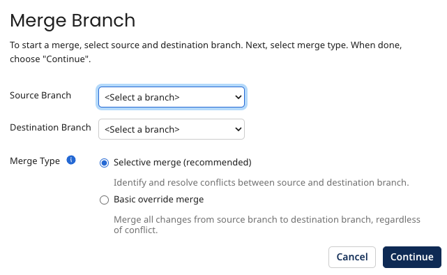
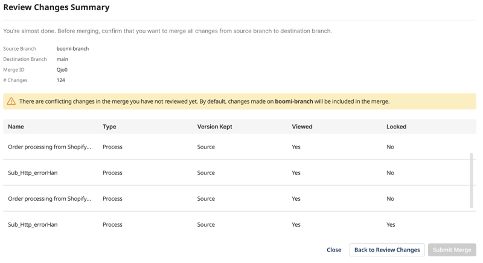
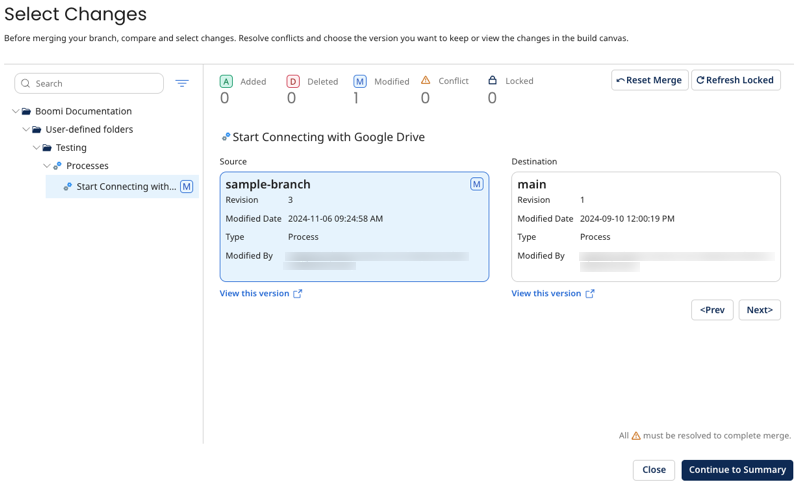
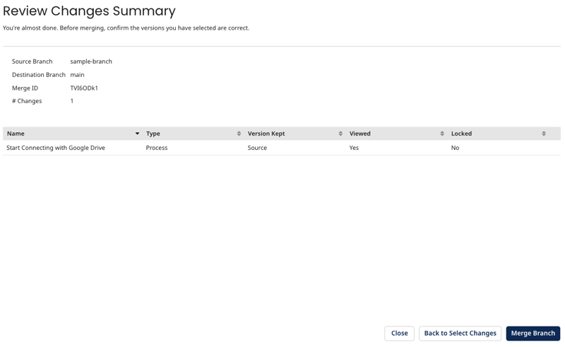
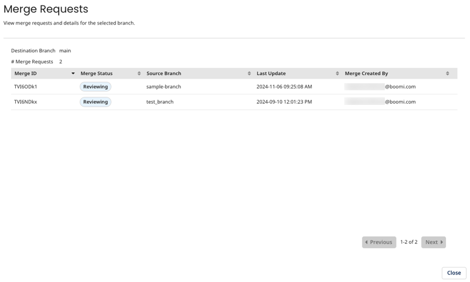

# Merging branches

<head>
  <meta name="guidename" content="Integration"/>
  <meta name="context" content="GUID-d2da3224-8a6b-48f8-b500-328c4654d37d"/>
</head>

When you have finished working in a branch, you can merge it into another branch from the Build canvas by clicking **Merge Branch** from the shortcuts sidebar or from Branch Management.

1. Select the source branch that you want to merge.

2. Select the destination branch into which you want to merge the source branch.

3. Choose the merge type:

   a. **Selective merge** - Any conflicts between the source and destination branches must be resolved before the merge can be submitted.

   b. **Basic override merge** - Merges all changes from the source branch to the destination branch regardless of any conflicts.

4. Click **Continue**.

<iframe width="560" height="315" src="https://www.youtube.com/embed/epxFIHKgGHE?si=V40DrQvmgUAP0DYh" title="YouTube video player" frameborder="0" allow="accelerometer; autoplay; clipboard-write; encrypted-media; gyroscope; picture-in-picture; web-share" referrerpolicy="strict-origin-when-cross-origin" allowfullscreen></iframe>

## Selective merge

With a selective merge, you can review your changes and also resolve any conflicts that might be between the source and destination branches. For example, if a map component has been modified in both branches, you can choose which version of the map you want to keep. You can't complete the merge until all conflicts are resolved and no components are locked.

:::note

Components are locked when they are open on the Build page. You must save and close them before completing a merge request.

:::

## Basic override merge

After selecting a basic override merge, you can review the changes you are about the merge into the destination branch. Conflicts will be indicated, but you can't resolve them manually. The version in the source branch is automatically used to resolve conflicts.

You must review all existing conflicts before you can proceed with the merge. A banner will display on the Review Changes Summary page and the **Submit Merge** button will be unavailable if there are unreviewed conflicts.

## Review your changes

Before you submit the merge for processing, you must review all of the changes. The Review Changes dialog detects and highlights all changes to components between the source and destination branches. If you are performing a selective merge, you can't move on to the next step in the merge flow until conflicts have been resolved.

If there are any locked components, make sure to unlock them in the destination branch before continuing. You can click **Refresh Locked** in the Review Changes dialog to refresh the components and continue to the merge summary.

In the Review Changes Summary dialog, you can review all changes one last time before submitting a merge.

This page shows the component name, type (such as process, connection, or map), which version is kept (source or destination), whether the components have been reviewed, and if they are locked.

Click **Merge Branch** to merge your changes into the destination branch. The merge can take anywhere from a few seconds to a few minutes to complete, depending on factors such as the number of components in your account. The branch status in Branch Management shows when a merge is in process.

## View open merge requests

You can see open merge requests on a branch in Branch Management by clicking **View Merge Requests** from the **Actions** menu.

To return to an open request to finish merging it, you go through the same process as creating one but select the same source and destination branch and the same strategy. For example, if you have an open request between `sample-branch` and `main` using **Selective Merge** that is in REVIEWING status, you can complete the merge by:

1. Open a merge request by clicking **Merge Branch** from Branch Management or the shortcuts sidebar on the Build page.

2. Select `sample-branch` for the Source branch and `main` for the destination branch.

3. Select **Selective Merge**.

You are returned to the Select Changes dialog and can continue reviewing your changes before completing the merge.

## Additional resources

[Branch and Merge FAQ](./int-Branch_and_merge_FAQ.md)
