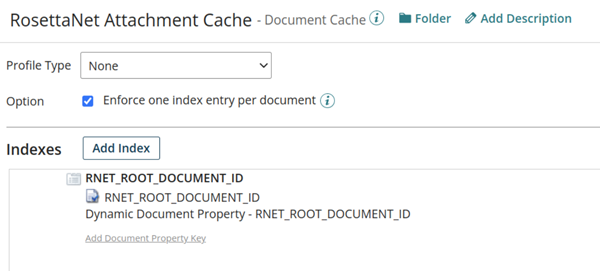

# RosettaNet messages with attached documents 

<head>
  <meta name="guidename" content="Integration"/>
  <meta name="context" content="GUID-e176e986-49e7-43b3-884d-a80d71ac6b69"/>
</head>

You can transmit Multipurpose Internet Mail Extensions \(MIME\) attachments with RosettaNet messages by using a Document Cache component to store and retrieve attachments, and by configuring a Trading Partner component to use an Attachment Cache configuration that points to the same Document Cache component.

**Note:** Only RosettaNet Implementation Framework \(RNIF\) version 2.0 supports attachments. If you currently use version 1.1, this feature is not supported.

## Dynamic document properties and document caches 

The RosettaNet connector identifies MIME attachments based on a dynamic document property called `RNET_ROOT_DOCUMENT_ID` that is added to a Document Cache component. This property is used to relate the business document, the RosettaNet message, and the attachment documents. It is the index key in the Document Cache when adding attachment documents for outbound messages and the lookup key for attachment documents when processing inbound messages. For outbound messages, you must provide a unique value for `RNET_ROOT_DOCUMENT_ID`, such as by using the Unique Value assignment in a Set Properties step. For inbound messages, the property is automatically assigned a unique value.

**Note:** You should configure a single Document Cache component for every associated Trading Partner to reduce the risk of misconfiguration, which could cause attachments to not be found.

## Trading Partner configuration 

The Trading Partner component for RosettaNet trading partners accepts an Attachment Cache configuration that points to a Document Cache component that is configured with a `RNET_ROOT_DOCUMENT_ID` dynamic document property.

The Attachment Cache configuration is added to the Trading Partner **Message Options** section. This option is available only for "Partner that I trade with" components.

When you configure the Start step for the Trading Partner type and the Trading Parter Action for the HTTP communication method, any listeners for RosettaNet trading partners that are added to the action are enabled. The HTTP communication method for RosettaNet trading partners should be configured with **MIME Passthrough** enabled.

## Receiving attachments 
When a Trading Partner connector receives a RosettaNet message that has one or more attachments, the following occurs:

-   The service content of the RosettaNet message is extracted and saved as the root document. A dynamic document property \(`RNET_ROOT_DOCUMENT_ID`\) is associated with the root document.

    **Note:** This is the same value that is used to index attachments in the Attachment Cache and can be used in a Document Cache RETRIEVE operation to fetch the attachments.

-   The receiving Trading Partner connector's operation **Attachment Cache** field identifies the document cache where the attachments are stored.

-   The attachments are extracted from the message, sent to the document cache, and saved as attachment documents.

-   The following dynamic document properties are added to the attachment documents:
    -   `RNET_ROOT_DOCUMENT_ID` - The attachment's unique identifier

    -   `RNET_ATTACHMENT_CONTENT_ID` - The attachment's content ID, if it exists

    -   `RNET_ATTACHMENT_CONTENT_TYPE` - \(Optional\) The attachment's content type

    -   `RNET_ATTACHMENT_NAME` - \(Optional\) The name of the attachment's content type

    -   `RNET_ATTACHMENT_DESCRIPTION` - \(Optional\) The attachment's content description

-   The body of the ROSETTANET message is sent to the integration process.

You can use the [Retrieve From Cache step](r-atm-Retrieve_From_Cache_shape_aed8db7a-b2e1-4d40-b3af-ef9fa0e19864.md) to retrieve the list of attachments associated with a document.

## Sending attachments 
When a process sends a ROSETTANET message that has one or more attachments to a Trading Partner connector, the following occurs:

-   The connector attempts to look up attachments in the receiving trading partner's configured attachment cache based on the `RNET_ROOT_DOCUMENT_ID` dynamic document property associated with each process document.

-   If the property is found, attachments are retrieved from the cache and each attachment is added after the service content as an additional MIME property value.

    **Note:** If the `RNET_ROOT_DOCUMENT_ID`property is not found or no attachment cache is specified in the receiving trading partner, no attachment processing occurs.

-   MIME property values are set by the dynamic document properties associated with the documents in the attachment cache.

    |Dynamic Document Property|MIME Property|
    |-------------------------|-------------|
    |`RNET_ATTACHMENT_CONTENT_ID`|Content-ID|
    |`RNET_ATTACHMENT_CONTENT_TYPE`|Content-Type|
    |`RNET_ATTACHMENT_NAME`|Content-Type name parameter|
    |`RNET_ATTACHMENT_DESCRIPTION`|Content-Description|
    |`RNET_ATTACHMENT_CONTENT_TRANSFER_ENCODING`|Content-Transfer-Encoding|

-   The RosettaNet message with MIME attachments is sent to the trading partner endpoint.