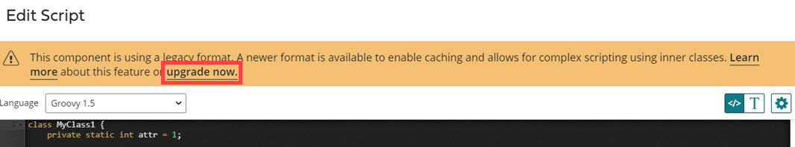

# Script execution and compilation behavior

<head>
  <meta name="guidename" content="Integration"/>
  <meta name="context" content="GUID-bba5a1b7-a9d7-4814-84e8-354abd8e49c8"/>
</head>


Learn about how custom Groovy scripts are compiled and executed within processes.

For Groovy 1.5 and 2.4, each unique script in the service is compiled and cached the first time that script is invoked after a new deployment. This allows subsequent invocations of that script within the same process, as well as subsequent process executions, to reuse the previously compiled and cached script for optimized efficiency. Script compilation is applicable to all script contexts including inline and component scripts, as well as Map function and Data Process scripts. Scripts are compiled and cached per deployed process.

:::note

JavaScript uses a different scripting engine which compiles scripts by default but does not support inner classes.

:::

As of the February 2022 release, all new and existing Groovy scripts automatically use this caching, with the exception of scripts that include inner class definitions. See the following sections for more information about how to manually upgrade scripts that use inner classes and to learn how scripting behavior works post-upgrade with inner classes.

:::info Important

Also, **private Molecule and Atom Cloud owners** using a [custom JVM security policy file](../Integration%20management/c-atm-Security_policies_for_Clouds_and_Molecules_19d244bf-2cab-45a8-8d8e-49ebde3eddc7.md) must manually update their policy files to take advantage of script caching. See the section **Modifying custom JVM security policy files** for detailed instructions.

:::

## Upgrading existing scripts with inner classes

To maintain backward compatibility, custom scripts created prior to February 2022 and which include inner class definitions do not automatically leverage the cached compilation behavior. You can manually upgrade these scripts in the Script component editor of the user interface.

**Do I need to manually upgrade my script?**

We recommend a manual upgrade specifically if the same inner class name is declared in multiple scripts within a given process, but has a different implementations. If caching is used, the process always uses the compiled version of the last occurrence of the inner class in the process, which could result in different execution results than originally designed and tested.

Prior to upgrading your scripts, you should carefully review the scripts used in the given process for potential inner class naming conflicts. If found, recommends that you use unique naming and re-verify the process functionality using Test Mode.

**How can I upgrade my script to use caching?**

If your script is eligible for upgrade, the **Edit Script** dialog for both inline scripts and Scripting components displays a warning message with an option to upgrade. On the user interface, click the "upgrade now" link on the warning. After clicking the link, the upgrade occurs for inline scripts when you click **Save** on the main component \(for example, the Map component or Data Process step\). For Scripting components, the upgrade occurs when you click **Save** on the Edit Script dialog.

:::note

Process and Script components are available from Component Explorer or within a Map function. Custom scripts are available within a Inline scripting step of a Data Process step or within a Map function.

:::



## Use of inner class declarations

In advanced scenarios, it is possible to declare inner classes within your scripts. Due to how classes are compiled and cached, we strongly recommend that you avoid naming conflicts between inner classes across different scripts that are used within the same process.

In the following scenario, a user has upgraded their scripts to enable caching. However, each script contains inner class declarations that are not uniquely named. This scenario demonstrates how such scripts are compiled.

-   Script 1

```java
class MyInnerClass {
public String getText() {
return "Hello";
}
}


logger.log(new MyInnerClass().getText());
```

-   Script 2

```java
logger.log(new MyInnerClass().getText());
```

-   Script 3

```java
class MyInnerClass {
public String getText() {
return "World";
}
}

logger.log(new MyInnerClass().getText());
```

-   Script 4

```java
logger.log(new MyInnerClass().getText());
```


Previously when a script was not enabled with cached compilation, the Groovy scripting engine compiled `MyInnerClass` every time it encountered a new declaration, and stored the latest compiled script to memory. Rerunning the scripts would have had the following results:

```
Script1: Hello
Script2: Hello
Script3: World
Script4: World
```


With cached compilation enabled, however, the Groovy scripting engine compiles `MyInnerClass` only on its first invocation, and reuses the compilation for every subsequent invocation.

In our scenario, the user has now enabled caching but attempts to rerun the same scripts without making their names unique. Notice that the same compilation occurs:

-   First run: \(no cache is available yet\)

    ``` {#codeblock_gfp_byt_mqb}
    Script1: Hello
    Script2: Hello
    Script3: World
    Script4: World
    ```

-   Second run and subsequent runs \(compiled script has been cached\):

    ``` {#codeblock_vcd_cyt_mqb}
    Script1: World
    Script2: World
    Script3: World
    Script4: World
    ```


To avoid this compilation scenario again, the user appends a package name to each script in order to make them unique:

-   Script 1

    ```java
    package my.package1;

    class MyInnerClass {
    public String getText() {
    return "Hello";
    }
    }

    logger.log(new InnerClass().getText());
    ```

-   Script 2

    ```java
    import my.package1.MyInnerClass;

    logger.log(new InnerClass().getText());
    ```

-   Script 3

    ```java
    package my.package2;

    class MyInnerClass {
    public String getText() {
    return "World";
    }
    }

    logger.log(new InnerClass().getText());
    ```

-   Script 4

    ```java
    import my.package2.MyInnerClass;

    logger.log(new InnerClass().getText());
    ```


By declaring the package name properly, the Groovy scripting engine makes a unique compiled version of each inner class as a result of their differing signatures.

## Modifying custom JVM security policy files

:::info Important

The use of CUSTOM security policy files is deprecated as of June 10, 2023. You should [convert to a HIGH security policy](../Integration%20management/int-Converting_from_a_custom_to_a_high_security_policy_6e30adbc-c806-497b-9e86-47b9487aa567.md) and use the [Atom Security Policies object](https://developer.boomi.com/api/platformapi#tag/AtomSecurityPolicies) to manage any customizations. For more information, see the deprecation notice [Custom Security Policy file deprecation for private Atom Clouds](https://community.boomi.com/s/article/Custom-Security-Policy-File-deprecation-for-private-Atom-Clouds).

:::

To take advantage of script caching, private Molecule and Atom Cloud owners using custom JVM security policy files must add additional properties to their policy files.

To confirm if your runtime is using a custom security policy, go to **Manage** \> **Atom Management** \> **select a Molecule or Atom Cloud** \> **Properties panel \(under Settings & Configuration\)** \> **Advanced tab**. If the **Security Policy** property is enabled and its value is set to CUSTOM, then your runtime uses custom security policy files and must be updated per the following instructions. If the property is not set to CUSTOM, no action is required.

1.  Locate the following custom security policy files for your runtime:
    1.  `<installation_directory>/bin/procrunner-CUSTOM.policy`
    2.  `<installation_directory>/bin/procworker-CUSTOM.policy`
    3.  `<installation_directory>/bin/procbrowser-CUSTOM.policy`
2.  For each file, open the file in a text editor.
3.  Locate the following two lines within the last grant \{ \} section:

    ``` {#codeblock_b1f_4l2_lsb}
    permission groovy.security.GroovyCodeSourcePermission "/groovy/script";
    permission java.io.FilePermission "/groovy/script", "read";
    ```

4.  Replace each of the lines in Step 3 with the following:

    ``` {#codeblock_a4w_rl2_lsb}
    permission groovy.security.GroovyCodeSourcePermission "/groovy/script";
    permission java.io.FilePermission "/groovy/script", "read";
    permission java.io.FilePermission "${com.boomi.container.accountDir}${/}cached_scripts${/}-", "read,write,delete";
    ```

5.  Save each file.
6.  Restart the runtime.

Adding these properties gives your runtime container the proper permissions to enable caching upgrades on your custom Groovy scripts.
