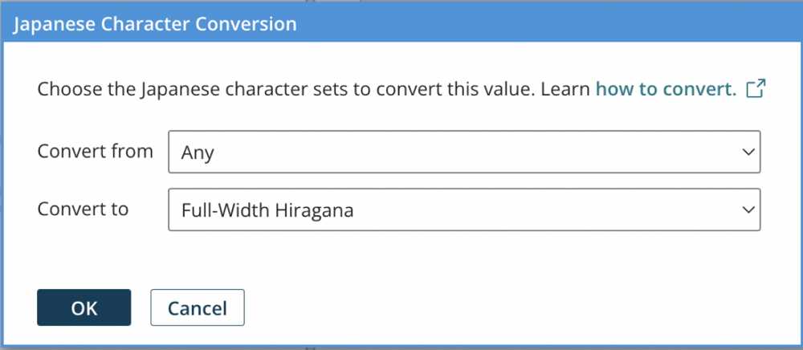
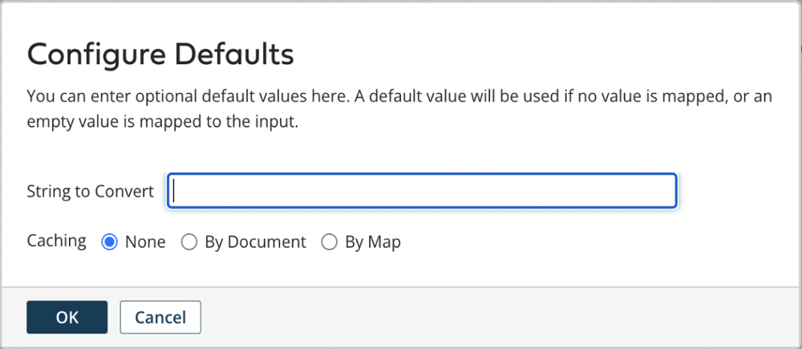

# Understanding Japanese Character Conversion

<head>
  <meta name="guidename" content="Integration"/>
  <meta name="context" content="GUID-902C226B-CE58-480A-96BC-B2BA62C6C46F"/>
</head>

The Japanese character conversion function lets you convert specific fields in your map between full-width and half-width Katakana and Hiragana Japanese character sets. Specifically, characters that match the selected **Convert from** character set will be converted to the selected **Convert to** character set.

**Considerations**

-   This function *transliterates* individual characters between different character sets. It does not translate entire words between different languages.
-   Only character-type input values are supported. Number and Date/Time types are not supported and will generate an error.
-   The Kanji alphabet is not supported.

**Configuration options:**

In the configuration dialog below, **Convert from** refers to the Japanese character set that describes the characters in the input to convert from. When converting from, selecting *Any* will convert any Katakana or Hiragana characters.

**Convert to** refers to the Japanese character set to which the parsed input characters are converted to. Depending on your selection in the **Convert from** field, this will convert any character into the character set you chose to be converted.

Full-width and half-width refer to the pixel width of the character itself. A set of full-width characters will be longer in length than their half-width counterparts. When converting from *Any*, if the input includes alphanumeric characters, those characters may be affected as well.

The **Convert from** options are:

-   Any
-   Full-Width Hiragana
-   Katakana

The **Convert to** options are:

-   Full-Width Katakana
-   Half-Width Katakana
-   Full-Width Hiragana

**Configure defaults:**

After selecting the desired **Convert from** and **Convert to** options, the **Configure Defaults** dialog shows where you can provide a default value.

**Usage examples**

When parsing the input value, only characters matching the selected **Convert from** character will be converted. Characters not matching the **Convert from** set will pass through unchanged. Matching characters are converted to the selected **Convert to** character set. The **Convert to** character set will determine both the Katakana/Hiragana alphabet AND full/half width of the matching characters. This has important considerations when the input value contains a combination of Japanese, alphanumeric, and half/full width characters.

| Input (string to convert)                                          | Convert from            | Convert to                       | Output (result)                                                                                                      |
|--------------------------------------------------------------------|-------------------------|---------------------------------|----------------------------------------------------------------------------------------------------------------------|
| *Mix of alphanumeric and Katakana full-width:* １ー２ー３ヤママチチョウ  | Any                     | Full-width Hiragana              | *Mix of alphanumeric and Katakana full-width converted to Hiragana:* １ー２ー３やままちちょう                             |
| *Mix of alphanumeric and Katakana half-width:* 1-2-3ﾔﾏﾏﾁﾁｮｳ            | Any                     | Full-width Katakana              | *Mix of alphanumeric and Katakana half-width converted to Katakana full-width:* １ー２ー３ヤママチチョウ                   |
| *Mix of alphanumeric and Hiragana:* １ー２ー３やままちちょう             | Any                     | Half-width Katakana              | *Mix of alphanumeric and Hiragana converted to half-width Katakana:* 1-2-3ﾔﾏﾏﾁﾁｮｳ                                      |
| *Mix of alphanumeric and English:* $i3dk&A2^3N7Qzh is a good password | Any                     | Full-width Hiragana              | *Mix of alphanumeric and English, not converted:* $i3dk&A2^3N7Qzh is a good password                                   |
| *Mix of alphanumeric and English:* $i3dk&A2^3N7Qzh is a good password | Any                     | Full-width or half-width Katakana| *Mix of alphanumeric and English not converted:* $i3dk&A2^3N7Qzh is a good password                                   |
| *Mix of alphanumeric and Katakana full-width:*「$i3dk&A2^3N7Qzh」はいいパースワードです | Katakana            | Full-width Hiragana              | *Katakana converted to Hiragana. Alphanumeric NOT converted to full-width:*「$i3dk&A2^3N7Qzh」はいいぱーすわーどです       |
| *Mix of alphanumeric and Hiragana:*「$i3dk&A2^3N7Qzh」はいいぱーすわーどです         | Hiragana             | Full-width Katakana              | *Hiragana converted to Katakana. Alphanumeric NOT converted to full-width:*「$i3dk&A2^3N7Qzh」はいいパースワードです       |
| *Mix of alphanumeric and Katakana full-width:*「$i3dk&A2^3N7Qzh」はいいパースワードです | Katakana            | Half-width Katakana              | *Katakana converted to half-width. Alphanumeric NOT converted to half-width:*｢$i3dk&A2^3N7Qzh｣はいいﾊﾟｰｽﾜｰﾄﾞです       |
| *Katakana full-width:* オツカレサマデス                                    | Katakana             | Full-width Hiragana              | *Full-width Katakana converted to Hiragana:* おつかれさまです                                                           |
| *Katakana, half-width:* ｵﾂｶﾚｻﾏﾃﾞｽ                                         | Katakana             | Full-width Katakana              | *Half-width Katakana converted to full-width Katakana:* オツカレサマデス                                                  |
| *Katakana, full-width:* オツカレサマデス                                    | Katakana             | Half-width Katakana              | *Full-width Katakana converted to half-width Katakana:* ｵﾂｶﾚｻﾏﾃﾞｽ                                                      |
| *Hiragana, full-width:* おつかれさまです                                    | Full-width Hiragana | Full-width Katakana              | *Full-width Hiragana converted to full-width Katakana:* オツカレサマデス                                                  |
| *Hiragana, full-width:* おつかれさまです                                    | Full-width Hiragana | Half-width Katakana              | *Full-width Hiragana converted to half-width Katakana:* ｵﾂｶﾚｻﾏﾃﾞｽ                                                      |