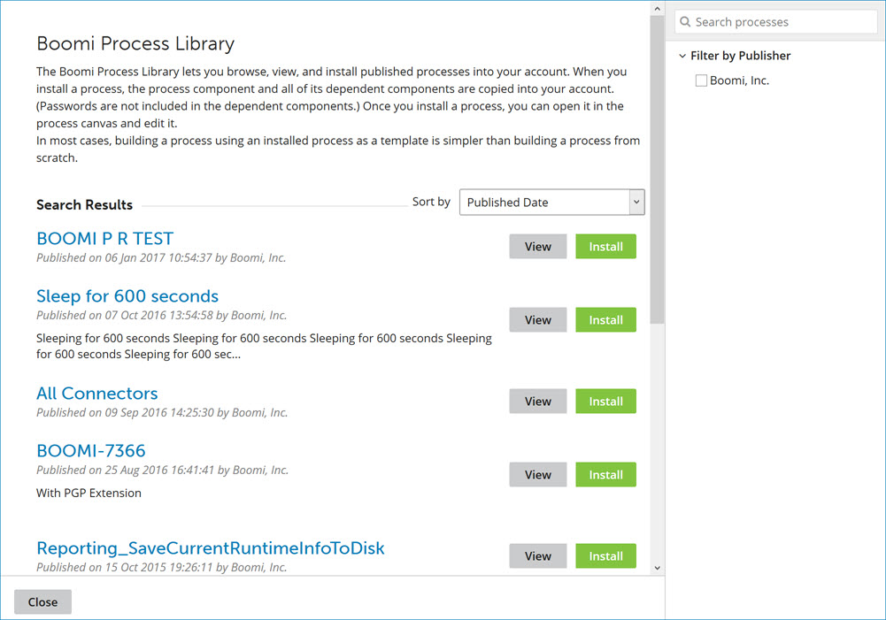
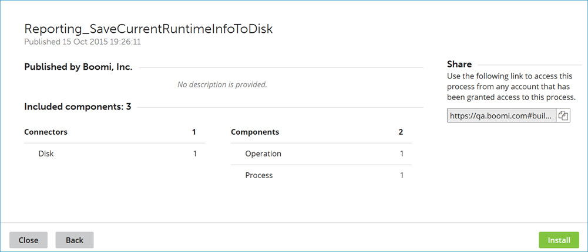
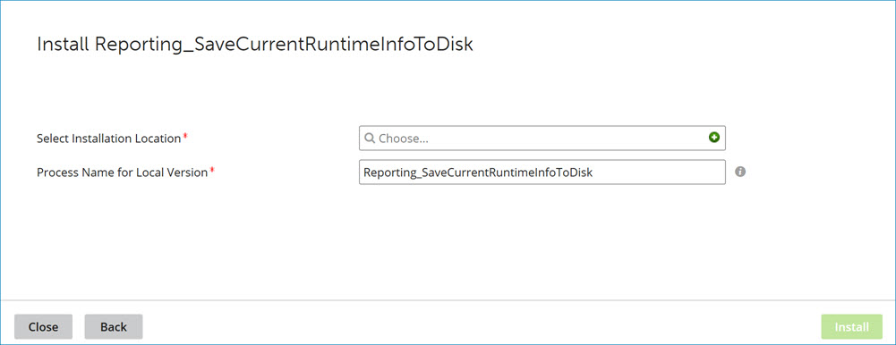
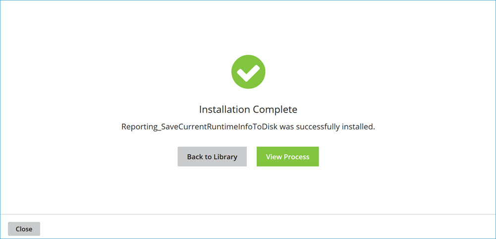

# Browse Process Library dialog

<head>
  <meta name="guidename" content="Integration"/>
  <meta name="context" content="GUID-cb1e5b35-683d-4756-aede-8ec2de3c3c9b"/>
</head>

Use the **Browse Process Library** dialog to browse and install published processes that are available to the account you are using. The processes in this list were either published by Boomi or published to account groups of which the account you are using is a member.

Open the Process Libraries dialog by clicking **Browse Process Library** link in the *Component Explorer* on the *Integration Build page*, or by clicking the **Browse all Processes** link on the **Start** tab. Once the dialog is open, you can sort the Process Library by most popular, published date, or process name.

You can search for processes by typing in the **Search processes** field. As you type, the process list is filtered to include only processes whose names or descriptions match the typed characters partially or completely. Pressing **Esc** or clicking  clears the field and stops the search.

You can also filter the list of processes by publisher name. In the **Filter by Publisher** list, select the check boxes for the publishers whose processes you want to see.

Click **View** for a process to display additional details about that process. Click **Install** to initiate a request to install the process.

## Process details

**Name**  
**Description**

Process name   
The name of the process.

Published   
The date and time at which the process was published.

Published by

The publisher of the process.

The publisher information for an account is defined on the Publisher tab in the Setup page \(**Setup** \> **Publisher**\).

Description

A description of the process, if one was provided.

Included components

A list of all the Connectors and Components that are included in the process. If the process includes Connectors that are not available in your account, you see an indicator that you are unable to install the process.

Share

A direct link to the process installation page on *Process Library*.

Click **Install** to initiate a request to install the process. Click **Back** to return to the process list.

## Process installation

**Name**   
**Description**

Select Installation Location   
Identifies the folder in which to install a copy of the process. Click ** Choose** to select a folder from the drop-down list or **** to create a new folder.

Process Name for Local Version   
\(Optional\) Specifies a name for the locally installed copy of the process. The default is the name of the published process.

Click **Install** to execute the process installation request. Click **Back** to return to the process details.

## Installation confirmation

The installation confirmation is accompanied by the following links:

**Name**   
**Description**

Back to Library   
Returns to the process list.

View Process   
Closes the dialog and opens the newly installed process for editing in the Build page.

Click **Close** to close the dialog and return to the Build page.