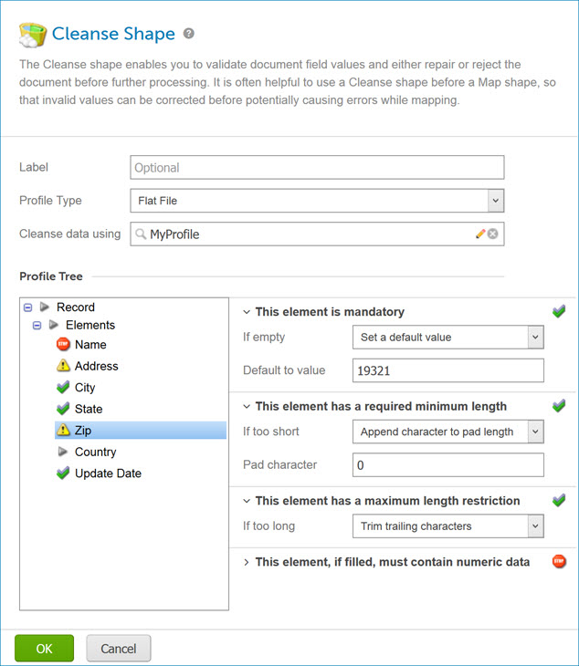

# Cleanse step

<head>
  <meta name="guidename" content="Integration"/>
  <meta name="context" content="GUID-652D6E11-9D6B-491B-8868-9905C48661F3"/>
</head>

The Cleanse step enables you to validate document field values and either repair or reject the document before further processing. It is often helpful to use a Cleanse step before a Map step, so that invalid values can be corrected before potentially causing errors while mapping.

The Cleanse step uses a profile to determine which restrictions to validate. The restrictions are defined in the profile at the field \(or element\) level. Restrictions defined on repeating or "detail-level" elements are automatically performed for each instance. The available restrictions differ slightly between different types of profiles but include:

-   Mandatory value

-   Minimum and maximum length

-   Date and numeric data type and formatting

For each element, you can configure how to handle each restriction violation: reject the document or repair the value. The repair options vary based on the type of restriction. It is important to understand that:

-   The entire document will be rejected immediately upon the first violation. Subsequent restrictions are not validated.

-   This also means that if your integration scenario involves a single batch file but requires individual records to be evaluated independently, you will need to use a Data Process step to split the data into individual documents before the Cleanse step.

Documents are cleansed and then passed down one of two paths, "Clean" or "Rejected", to be processed accordingly. If a document is rejected, the message is made available as a document property \(**Document Property** \> **Meta Information** \> **Base** \> **Cleanse Result Message**\). This value can be referenced in a Notify or Exception step to create an alert, for example. At execution time, the Rejected path is executed first followed by the Clean path.

Rejected documents are processed before "clean" documents. This allows you to halt the entire process \(using a Stop or Exception step\) if a single document is rejected, if required by your integration scenario.

:::note

The Cleanse step trims leading and trailing spaces from XML document data elements.

:::

## Cleanse step dialog

**Name**   
**Description**

**Label**   
\(Optional\) User-defined name to describe the step. If one is not entered “Cleanse” appears on the step. The selected profile type also appears on the label.

**Profile Type**   
-   Database

-   EDI

-   Flat File

-   XML

-   JSON \(Not currently supported\)

**Choose Profile**   
Used to choose, edit or create a Profile component.

**Profile Tree**   
Displays the elements in the selected Profile component. When you select an element you see the restrictions set in the profile and the available repair options.

**This element is mandatory**   
If empty:

-   No repair — reject document

-   Set a default value

Default to value \(available if **Set a default value** is selected\) — Enter a default value in this field.

**This element has a required minimum length**   
If too short:

-   No repair — reject document

-   Prepend character to pad length

-   Append character to pad length

Pad character\(available if **Prepend or Append character to pad length** is selected\) — Enter a character in this field.

**This element has a maximum length restriction**   
If too long:

-   No repair — reject document

-   Trim leading characters

-   Trim trailing characters

**This element, if filled, must contain \(date, numeric\) data**   
In profiles created as of the October 2013 release or later, the Cleanse step catches numeric fields containing *any* non-numeric data. In profiles created prior to the October 2013 release, the Cleanse step does not catch numeric fields consisting of a leading number followed by one or more characters.

If non-numeric / If not a date:

-   No repair — reject document

-   Set a default value

Default to value \(available if **Set a default value** is selected\) — Enter a default value in this field.