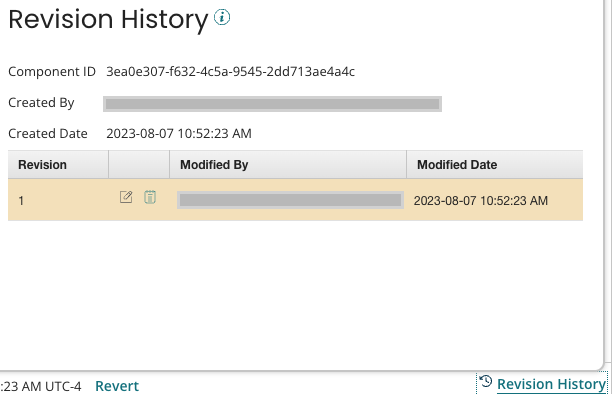

# Viewing a Component’s Revision History

<head>
  <meta name="guidename" content="Integration"/>
  <meta name="context" content="GUID-9BA3E269-6D29-4727-916D-DC0628C16478"/>
</head>

You can view the revision history of a component in the **Revision History** dialog box. If you have the Branch and Merge feature enabled on your account, the revision history shows the revisions for your current branch. To see the component's full history, click **Show Full History**.

Open a component and click ** Revision History**, to get to the **Revision History** dialog. Here you can:

- View standard information about the component.

- View the revision history.

- View or edit previous revisions of the component.

- View the component's XML.

- View source components if the current component was copied.

To view source components, you must have access rights to the source account.

- **Component ID** - Unique identifier of the component.

- **Created By** - User name and email address of the user who created the component.

- **Created Date** - Date and time at which the component was created.

- **Revision** - Revision numbers with the most recent revision at the top.

- **Actions** - You might see the foloowing actions:

  - **View/Edit Revision icon** - Allows you to view or edit the selected revision of the component.

  - **View Component XML icon** - Allows you to view the component's XML.

  - **Copied From icon** - Opens the source component from which this revision was copied. This icon appears only if you have access rights to the source account.

- **Modified By** - For each revision, the user name and email address of the user who modified it.

- **Modified Date** - For each revision, the date and time at which the component was modified.