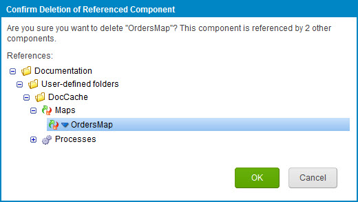

# Confirm Deletion of Referenced Component dialog

<head>
  <meta name="guidename" content="Integration"/>
  <meta name="context" content="GUID-d2089ece-9403-451d-9748-b023eead081b"/>
</head>

When you use the Component Explorer to select a component for deletion, the component may or may not be referenced by other components. If it is not referenced, you simply confirm or cancel the deletion. If it is referenced by other components you can still delete it, but it is useful to know which other components are affected by the deletion.

If the component being deleted is referenced by other components, the Confirm Deletion of Referenced Component dialog opens. This dialog displays:

-   A message showing the number of components that reference the component that you want to delete.

-   A subset of the Component Explorer, containing only the components that reference the component that you want to delete and the component itself.

If you want to view any of the components, you can use this dialog to navigate to them, then open the components on a separate web page. This allows you to assess the impact of the potential deletion.

Note that when a component is deleted, it is no longer usable in the process canvas and is not visible by default in *Component Explorer*. However, deleted components can be restored. For more information about how to restore a component's functionality, see the topic [Deleted component restoration](c-atm-Deleted_component_restoration_849e05de-1a6a-4e55-a2e3-683c7acc4ae1.md).