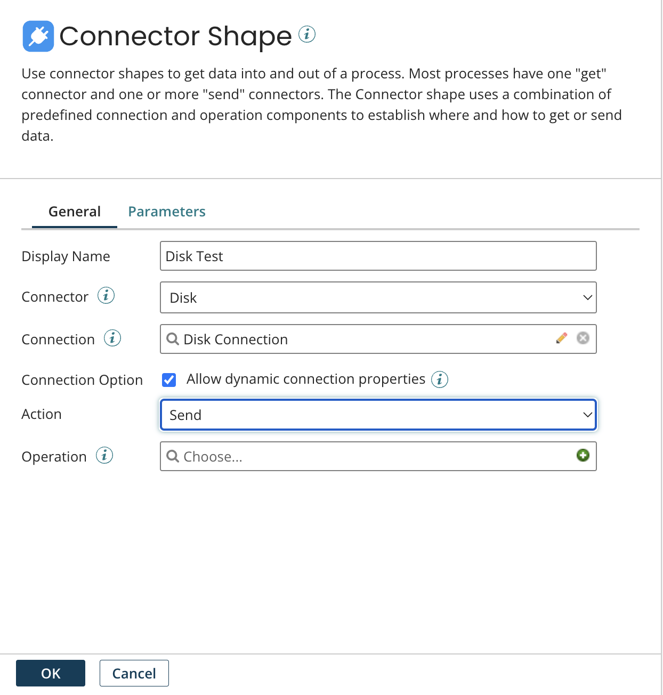

# Connector step dialog, General tab

<head>
  <meta name="guidename" content="Integration"/>
  <meta name="context" content="GUID-dc3bf2d8-e154-444e-8a8f-a0d07f489bfb"/>
</head>

Set the connector, connector action, Connection component, and Operation component for a Connector step in the **General** tab of the Connector step dialog.

**Name**

**Description**

**Display Name**   
(Optional) User-defined name to describe the step. If one is not entered, the name of the connector that you select appears on the step.

**Connector**   
When used within a process, this is used to select the type of data source or destination, depending on where the data is coming from or going to.

When used in the Start step, this is used to select the application or server your would like to connect to, or a listen web server that you would like to enable, to bring documents into the process.

**Connection**    
Used to select, edit or create a Connection component for your specific application or server. The list of connections is filtered by the type of connector that you select. Connection components are reusable in other processes and process steps.

**Action**    
The available actions are determined by the type of connector that you select. Examples are: Get, Send, Create, Query, Delete, Update, etc.

When used in the Start step, this is used to select the inbound action for your documents.

- Get — Retrieves documents from application or server.
- Listen — Enables process listening for certain connector scenarios (for example, AS2, Web Services Server). You need to deploy the process to enable the web server for listening.

**Operation**    
Used to select, edit or create an Operation component for your specific application or server. The list of operations is filtered by the type of connector and action that you select. Operation components are reusable in other processes and process steps.

During the configuration of connector operation components, the Import Operation wizard defaults to the selected connection component. This behavior occurs when making a connector call from the Start step, a Connector step, a parameter value, or a map function.

**Allow dynamic connection properties**    
When selected, any [Dynamic Process Connection properties](int-Dynamic_Process_Connection_properties_9067300c-3df3-40ba-97b3-5a6a03a3a6dc.md) that are defined in the Set Properties step override connector settings and extension values within subsequent Connector steps. When cleared, the values set in connection settings and extensions values take precedence, even if Dynamic Process Connection properties are defined within the Set Properties step.

If the same connection is used multiple times within a process, the option needs to be enabled on each of the Connector steps. If this is not set, the same connections are executed with varying values at different points in the process.