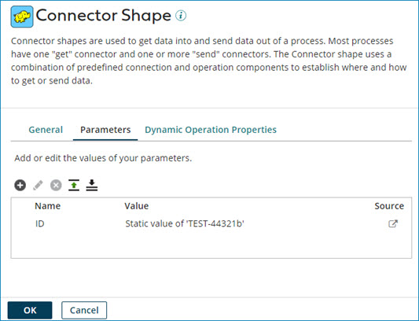

# Connector step dialog, Parameters tab

<head>
  <meta name="guidename" content="Integration"/>
  <meta name="context" content="GUID-2b8519a4-c797-4a45-8600-22d651406b60"/>
</head>

Some connectors enable you to define parameters in their operations to dynamically set certain criteria. The Connector step dialog's **Parameters** tab allows you to provide dynamic or static values for those parameters. You can add, edit, delete, and put the parameters into a particular order.

Error indicators are also shown on this tab if multiple values are given for the same parameter name, a value is set without an associated name, or if not all parameters are defined.

