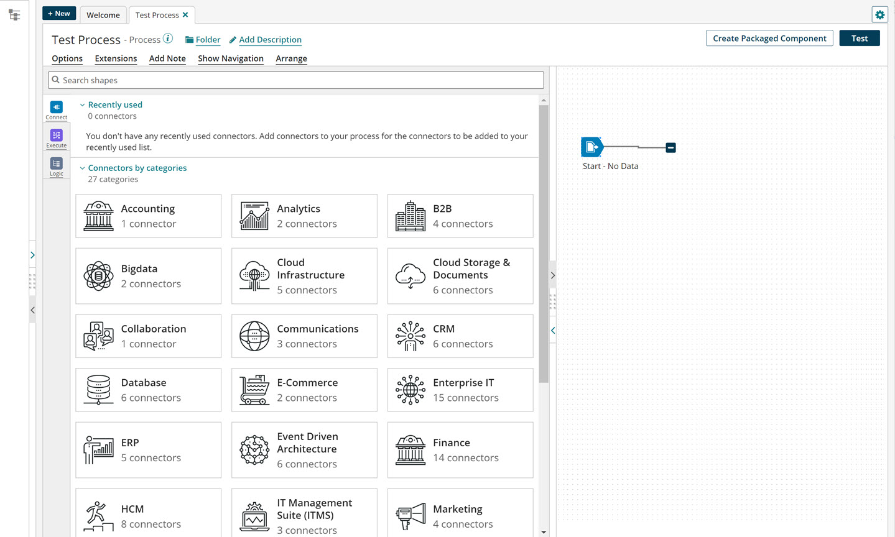
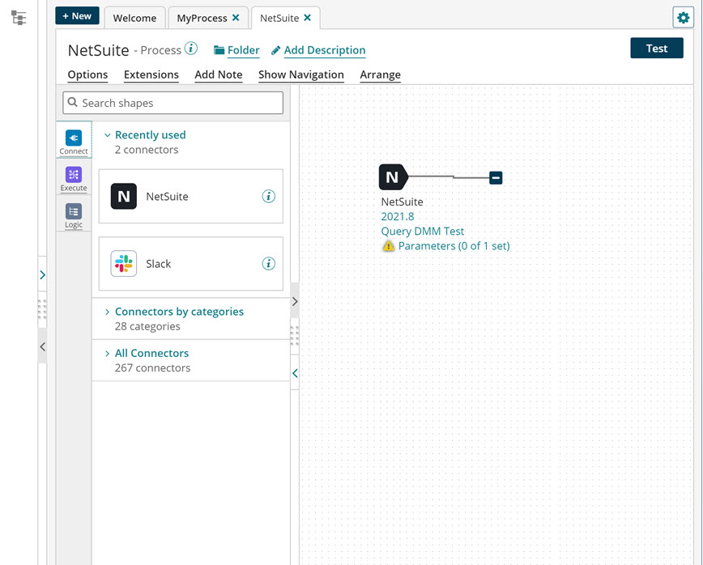

# Connector step

<head>
  <meta name="guidename" content="Integration"/>
  <meta name="context" content="GUID-BC5F93AA-8849-4B4E-AA49-023201D1EB0E"/>
</head>

The connector steps allow you to contain all of the information that is needed to connect to a data source or application within your processes.

Connectors enable you to easily connect one third-party application to another, such as Salesforce to NetSuite, to send and receive data. When you are assigned a account, you have access to all application and technology \(public\) connectors.

:::note

For many application connectors, the step icon is specific to the application.

:::

Connectors are arranged within the Connect tab by those that you recently used, by category, and then in single list of all connectors alphabetically. The following image shows the Connect tab of the step palette.

Within the Connectors by categories section, you can see all of the available connectors for a specific category of integration processes. If you cannot find the needed connector from the available list, you can view the list of publicly available open-source connectors. Information about the open-source connectors appears at the bottom of the All connectors category.

## Connector components

Connectors are a combination of two components that are separately stored in the Component Explorer:

-   Connection — The physical connection information; you define the URL of a data source or application, and provide credentials to access it.
-   Operation — The function to call or files to act upon; how to process the data.

Because both connections and operations are reusable components, you can, for example, create a single connection and pair it with different operations.

The following image is an example of a configured NetSuite connector. In this example, 2021.8 is the connection; Query DMM Test is the operation.

## Connector types

There are three different types of connectors:

-   Application connectors — Provide connectivity to specific software applications such as Netsuite, Salesforce, SAP, Amazon, etc. When you build endpoints into an integration, your first choice should be to use an application connector. has already resolved many specific issues to get you connected faster. In addition, application connectors may support multiple versions of a specific API.
-   Technology connectors — Provide connectivity to and from web applications, on-premise applications, and common data repositories using various protocols \(including HTTP, FTP, JMS, etc.\) using a standard data transport method or generic data driver. The data format or profile for technology connectors is independent from the connector’s operation. You can, for example, send any type of data to an FTP directory or HTTP URL. Boomi recommends using an application connector if possible.

-   Custom connectors — You can develop, deploy, and publish custom connectors. Your build can leverage the Connector API using the Connector SDK and its companion \). The Connector SDK supports REST web services, the SOAP Framework, a collection of third-party libraries, and custom code that enables easy integration. Another valuable resource for custom connector developers is the [Connector SDK Developers Community](https://community.boomi.com/community/connector-sdk) where you can collaborate with other SDK developers, view knowledge articles, ask questions, and learn how to extend the 's connectivity through custom connector development.