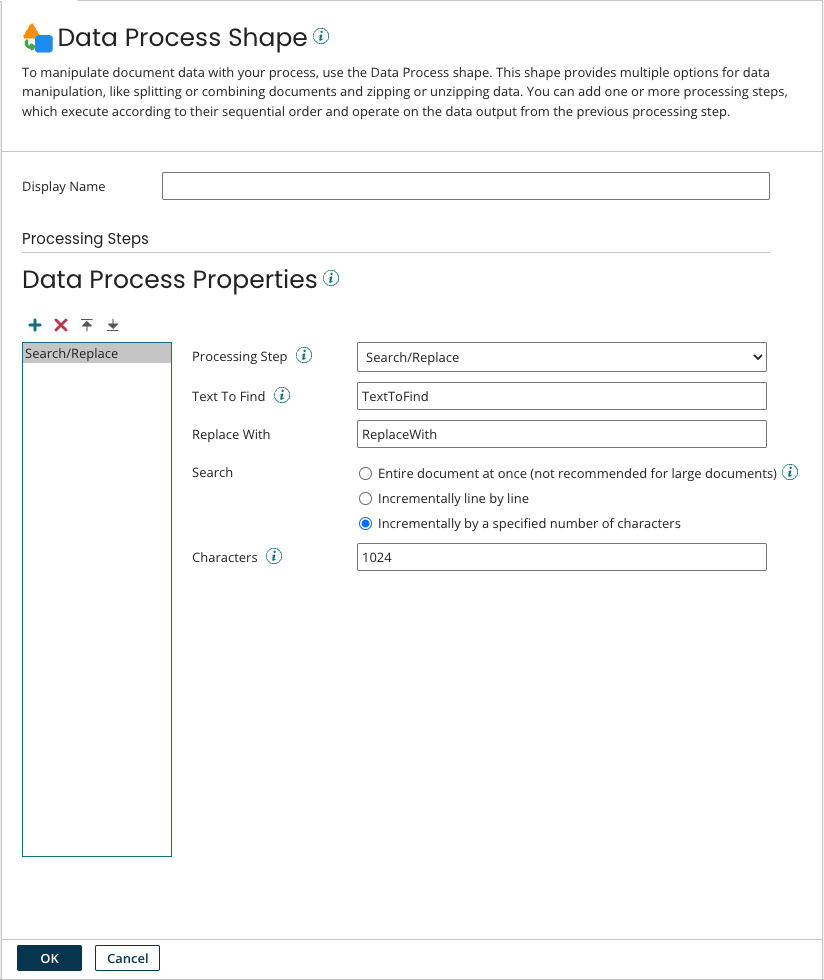

# Data Process step

<head>
  <meta name="guidename" content="Integration"/>
  <meta name="context" content="GUID-A07CD67B-AA78-4D86-89BD-EAC9356C1E14"/>
</head>

The Data Process step provides a number of options for manipulating document data within a process, from splitting and combining documents to zipping and unzipping data.

You can define multiple processing steps to perform more than one action on the document data. The processing steps will be executed in the order defined in the Data Process step. Each processing step will operate on the data output from the previous processing step.



## Data Process step dialog

- **Display Name** - (Optional) Names the step. If you do not enter a name, “Data Process” appears on the step.

- **Processing Steps (icons)** - Defines processing steps in a Data Process step using icons to add, delete, move up and move down the processing steps.

  You can use the following process types when adding processing steps to a Data Process step.

  - BASE64 Decode - Decodes document data from Base64 encoding to plain text.
  - BASE64 Encode - Encodes document data from plain text to Base64 encoding.

- **Character Decode** - Decodes document data from the selected character set to the system default \(typically UTF-8\).

  In the Character Set, you can use any standard Java platform character set :

  - US-ASCII — Seven-bit ASCII, a.k.a. ISO646-US, a.k.a. the Basic Latin block of the Unicode character set
  - ISO-8859-1 — ISO Latin Alphabet No. 1, a.k.a. ISO-LATIN-1
  - UTF-8 — Eight-bit UCS Transformation Format
  - UTF-16BE — Sixteen-bit UCS Transformation Format, big-endian byte order
  - UTF-16LE — Sixteen-bit UCS Transformation Format, little-endian byte order
  - UTF-16 — Sixteen-bit UCS Transformation Format, byte order identified by an optional byte-order mark

  You can use many other character sets as well but the additional options are Atom-dependent.

- **Character Encode** - Encodes document data from the system default \(typically UTF-8\) to the selected character set. You can use any standard Java platform character set described in Character Decode.

- **Combine Documents** - Combines multiple documents into a single document. Each document's data is simply appended to the previous document's data. This combines multiple documents read in from the Start step's Get connector or that were created as a result of splitting documents in a Data Process step. The Combine Documents process type can be used with the following profile types:

  - Flat File — See the Data Process step: Split/Combine Flat Files topic.
  - XML — See the Data Process step: Split/Combine XML or JSON Files topic.
  - JSON — See the Data Process step: Split/Combine XML or JSON Files topic.
  - “None” Profile Type — If you select the “None” profile type, the documents are combined without regard to their internal structure.

- **Custom Scripting** - Provides the ability to use custom scripting to perform special processing requirements. You can access and modify the actual document data and tracked properties using JavaScript or Groovy.

  A custom script can be inserted inline as part of the processing step. If you prefer, you can reference a Process Scripting component that is available for reuse. Either way, there is no need to compile because the script is ready to execute when you save the process.

- **Search/Replace** - Allows you to use regular expressions to search the document for specific strings or characters defined in the search text box. Once the data is located it will be replaced with the string or characters defined in the replace text box. For more information about regular expressions, see [http://java.sun.com/docs/books/tutorial/essential/regex/](http://java.sun.com/docs/books/tutorial/essential/regex/).

  The **Search** setting specifies the search method. The default is to search incrementally with the search buffer functioning as a “rolling window” whose size is the specified number of **Characters**. In other words, **Characters** specifies the maximum number of characters that can match the search target. For example, to replace “this” with “that” in “this is a test string”, you need to set **Characters** to 4 or greater. The default is 1,024 characters, which is the size of the buffer cache on most systems and therefore is the recommended setting.

  The option to search incrementally line by line is also available, as is the option to search the entire document at once. The latter method is not recommended, especially for large documents, as explained in the following note.

  :::note

  Searching the entire document essentially loads two copies of the document into memory at the same time. Also, the Java representation of a string uses two bytes per character. Therefore, you need memory equal to a minimum of approximately four times your document size in order to process the entire document successfully — for example, a 4MB document would require roughly 16MB of memory.

  Boomi-managed Atom Clouds run forked executions with 512MB of memory. While theoretically you could search documents of up to 100MB in their entirety in a -managed Atom Cloud, leaving some overhead for the Atom itself, the practical maximum document size is likely barely half of that due to memory fragmentation. In a local Atom or Molecule, memory fragmentation is potentially an even greater limiting factor.

  :::

- **Split Documents** - Splits a document into multiple documents by line, or based on a profile element value. When working with a batch of data, splitting is typically necessary to be able to perform various validations and routing on a per-record basis. To split data by a database profile, use the batching option in the database operation. The Split Documents process type can be used with the following profile types:

  - Flat File — See the Data Process step: Split/Combine Flat Files topic.
  - XML — See the Data Process step: Split/Combine XML or JSON Files topic.
  - JSON — See the Data Process step: Split/Combine XML or JSON Files topic.
  - EDI — EDI data can be split by a segment or data element. Each instance of the link element and its child data will be put into a separate document. The EDI split does not "group" records with the same link/split element value like the Flat File split does.
  - Profile — When splitting by profile, you must select an EDI profile.
  - Link Element— When splitting by profile, you must select a segment or data element.
  
  Modifying any elements within the profile will reset the value of the link/split element, regardless of which specific element has been modified or linked.

- **Map JSON to Multipart Form Data MIME** - Converts an input JSON document containing simple form data and file attachments into a multipart/form-data MIME document.

  If the JSON document contains file attachments, specify the appropriate Document Cache and Cache Index to retrieve the file attachments. To generate the MIME document, the input JSON document must also specify any headers that should be included within the MIME document. The input JSON document must also include type elements to differentiate between simple data and file attachments. The element name of a file attachment is used as the key when retrieving the file attachment from the Document Cache.

  If the Type element in the JSON document is defined with a "key" value, then a Content-Type element must be included to indicate the file or data type of the document. If Content-Type is defined by any value that is not text/plain data, the "key" Type element should be treated as a file attachment. If the Type element is defined with a "data" value, the Data Process step infers that the incoming content contains text/plain data and therefore does not require a value for Content-Type.

  :::note

  If Type is defined by a key that references a file and the Content-Transfer-Encoding value isn't provided, then a default Content-Transfer-Encoding value is inserted based on MIME RFC standards. Valid fields for Content-Transfer-Encoding are: "7bit", "8bit", "binary", "quoted-printable", "base64", ietf-token, and x-token. For more information, see the MIME RFC Standards link located in the **Additional Resources** section.

  :::

  The following is an example of a JSON input document:

  ```json
  {
  "FirstName" : {
    "value" : "John",
    "Content-Type" : "text/plain; charset=ISO-8859-1",
    "Content-Transfer-Encoding" : "8bit",
    "type" : "data"
    },
  "LastName" : {
    "value" : "Doe",
    "Content-Type" : "text/plain",
    "Content-Transfer-Encoding" : "8bit",
    "type" : "data"
    },
  "Email" : {
    "value" : "johndoe@boomi.com",
    "Content-Type" : "text/plain; charset=ISO-8859-1",
    "Content-Transfer-Encoding" : "8bit",
    "type" : "data"
    },
  "Phone" : {
    "value" : "6105555555",
    "Content-Type" : "text/plain; charset=ISO-8859-1",
    "Content-Transfer-Encoding" : "8bit",
    "type" : "data"
    },
  "resumeAttachment" : {
    "value" : "resume.docx",
    "Content-Type" : "application/document",
    "Content-Transfer-Encoding" : "binary",
    "type" : "key"
    }
  }
  ```

  The following is an example of a JSON to multipart/form-data MIME output document:

  ```json
  Content-Type: multipart/form-data; boundary=xxxxxxxxxxxxxxxxxxxxxxxxxxxxxx

  --xxxxxxxxxxxxxxxxxxxxxxxxxxxxxx
  Content-Disposition: form-data; name="FirstName"
  Content-Type: text/plain; charset=ISO-8859-1
  Content-Transfer-Encoding: 8bit

  John

  --xxxxxxxxxxxxxxxxxxxxxxxxxxxxxx
  Content-Disposition: form-data; name="LastName"
  Content-Type: text/plain
  Content-Transfer-Encoding: 8bit

  Doe

  --xxxxxxxxxxxxxxxxxxxxxxxxxxxxxx
  Content-Disposition: form-data; name="Email"
  Content-Type: text/plain; charset=ISO-8859-1
  Content-Transfer-Encoding: 8bit

  johndoe@boomi.com

  --xxxxxxxxxxxxxxxxxxxxxxxxxxxxxx
  Content-Disposition: form-data; name="Phone"
  Content-Type: text/plain; charset=ISO-8859-1
  Content-Transfer-Encoding: 8bit

  610555555

  --xxxxxxxxxxxxxxxxxxxxxxxxxxxxxx
  Content-Disposition: form-data; name="resume Attachment" filename="resume.docx"
  Content-Type: application/vnd.openxmlformats-
  officedocument.wordprocessingml.document
  Content-Transfer-Encoding: binary

  t4U«¨ªÚéãkü@×&™ì¾i ­ õO,îã\s8VŸÞ9›(*Eâø3Ï™eJÅ>q~½¾Lcg

  --xxxxxxxxxxxxxxxxxxxxxxxxxxxxxx--
  ```

- **Map Multipart Form Data MIME to JSON** - Converts an input multipart/form-data MIME document into a single JSON output document by mapping simple data and attachment files into JSON objects. Both simple data form elements and attachment files of the input MIME document are referenced directly in the JSON output document using a type element to differentiate them.

  File attachments are stored in the Document Cache. The element form name of the attachment is used as the key, and is indicated in the JSON output document in an element called "type".

  The following is an example of a multipart/form-data MIME input document:

  ```json
  Content-Type: multipart/form-data; boundary=Y-BFLHmahNxCutH0ijbUpI9_csBSF9fVt672JxIh

  --Y-BFLHmahNxCutH0ijbUpI9_csBSF9fVt672JxIh
  Content-Disposition: form-data; name="FirstName"
  Content-Type: text/plain; charset=ISO-8859-1
  Content-Transfer-Encoding: 8bit

  John
  --Y-BFLHmahNxCutH0ijbUpI9_csBSF9fVt672JxIh
  Content-Disposition: form-data; name="LastName"
  Content-Type: text/plain
  Content-Transfer-Encoding: 8bit

  Doe
  --Y-BFLHmahNxCutH0ijbUpI9_csBSF9fVt672JxIh
  Content-Disposition: form-data; name="Email"
  Content-Type: text/plain; charset=ISO-8859-1
  Content-Transfer-Encoding: 8bit

  johndoe@boomi.com
  --Y-BFLHmahNxCutH0ijbUpI9_csBSF9fVt672JxIh
  Content-Disposition: form-data; name="Phone"
  Content-Type: text/plain; charset=ISO-8859-1
  Content-Transfer-Encoding: 8bit

  6105555555
  --Y-BFLHmahNxCutH0ijbUpI9_csBSF9fVt672JxIh
  Content-Disposition: form-data; name="resumeAttachment" filename="resume.docx"
  Content-Type: application/vnd.openxmlformats-officedocument.wordprocessingml.document
  Content-Transfer-Encoding: binary

  t4U«¨ªÚéãkü@×&™ì¾i õO,îã\s8VŸÞ9›(*Eâø3Ï™eJÅ>q~½¾Lcg

  --Y-BFLHmahNxCutH0ijbUpI9_csBSF9fVt672JxIh--
  ```

  The following is an example of a multipart/form-data MIME to JSON output document:

  ```json
  {
  "FirstName" : {
    "value" : "John",
    "Content-Type" : "text/plain charset=ISO-8859-1",
    "Content-Transfer-Encoding" : "8bit",
    "type" : "data"
    },
  "LastName" : {
    "value" : "Doe",
    "Content-Type" : "text/plain",
    "Content-Transfer-Encoding" : "8bit",
    "type" : "data"
    },
  "Email" : {
    "value" : "johndoe@boomi.com",
    "Content-Type" : "text/plain charset=ISO-8859-1",
    "Content-Transfer-Encoding" : "8bit",
    "type" : "data"
    },
  "Phone" : {
    "value" : "6105555555",
    "Content-Type" : "text/plain charset=ISO-8859-1",
    "Content-Transfer-Encoding" : "8bit",
    "type" : "data"
    },
  "resumeAttachment" : {
    "value" : "resume.docx",
    "Content-Type" : "application/vnd.openxmlformats-officedocument.wordprocessingml.document",
    "Content-Transfer-Encoding" : "binary",
    "type" : "key"
    }
  }
  ```

- **PGP Encrypt** - Allows you to encrypt a file based on the desired security setting and certificate.

  - Process Type — PGP Encrypt.
  - Security Setting — Encrypt, Sign, or Sign and Encrypt.
  - Encrypt Cert — Used to select a Certificate component for encrypting.
  - Signing Cert — Used to select a Certificate component for signing.
  - Clear Text — For a Security Setting of Sign, controls whether PGP messages are processed as readable text.

  You also have the option to use a document property to set the file name for the PGP-encrypted file.

  - Connector \(Optional\) — Used to select a connector. The choices are: None, AS2 Connector, Disk, FTP, JMS, Mail and SFTP.
  - Action \(Optional\) — Used to select an action \(for example, Send\) for the selected connector.
  - Property \(Optional\) — Used to select a document property to use as the file name. The list of document properties varies based on the connector that you select.

  <iframe width="560" height="315" src="https://www.youtube.com/embed/RymSV48Q9_A?si=9arv2pzBvYW9FSJQ" title="YouTube video player" frameborder="0" allow="accelerometer; autoplay; clipboard-write; encrypted-media; gyroscope; picture-in-picture; web-share" referrerpolicy="strict-origin-when-cross-origin" allowfullscreen></iframe>

- **PGP Decrypt** - Allows you to decrypt a file based on the defined certificates.

  - Process Type — PGP Decrypt.
  - Decrypt Cert — Used to select a Certificate component for decrypting.
  - Signing Cert — Used to select a Certificate component for signing. The **Enforce Strict Signed Check** setting controls whether unsigned documents should be accepted.

  For a PGP-decrypted file you also have the option to get the file name and put it in a document property.

  - Connector (Optional) — Used to select a connector. The choices are: None, AS2 Shared Server Connector, Disk, FTP, HTTP Client, JMS, MLLP Server, Mail and SFTP.
  - Action (Optional) — Used to select an action (for example, Get or Listen) for the selected connector.
  - Property (Optional) — Used to select a document property to use as the file name. The list of document properties varies based on the connector that you select.

- **XSLT Transformation** - Allows you to transform and process an input XML document into another output XML document using a user-defined XSLT stylesheet.

  In the XSLT Transformation step, you can browse for and select an XSLT Stylesheet component that is available for reuse, or create a new XSLT Stylesheet component to define your XSLT script. When an XML document passes through the XSLT Transformation step, the Data Process step executes the transformation script from the selected XSLT Stylesheet component.

  The value of a variable within an XSLT stylesheet can be set and retrieved using a dynamic document property. For example, dynamic document properties can be used with an XSLT transformation to receive runtime data from to be used in the XSLT transformation, or send data from inside the transformation to subsequent steps. For more information, see Related topics for using dynamic document properties with XSLT Transformations.

- **Zip** - Allows you to zip incoming data that is in the WinZip compression format. The incoming data is zipped and the documents are passed through the Data Process step into the process.

  - Process Type — Zip.

  You can use a document property to set the zipped file’s file name.

  - Connector (Optional) — Used to select a connector.
  - Action (Optional) — Used to select an action (for example, Send) for the selected connector.
  - Property (Optional) — Used to select a document property to use as the file name. The list of document properties varies based on the connector that you select.

- **Unzip** - Allows you to unzip incoming data that is in the WinZip compression format. The incoming data is unzipped and the documents are passed through the Data Process step into the process.

  - Process Type — Unzip.

  For the file to be unzipped, you can get the zipped file’s file name and put it in a document property.

  - Connector (Optional) — Used to select a connector.
  - Action (Optional) — Used to select an action (for example, Get or Listen) for the selected connector.
  - Property (Optional) — Used to select a document property to use as the file name. The list of document properties varies based on the connector that you select.

## Additional Resources

[Multipurpose Internet Mail Extensions \(MIME\) RFC Standards](https://www.ietf.org/rfc/rfc2045.txt)
