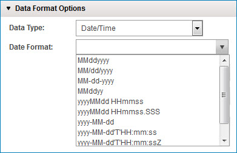

# Date/Time data type

<head>
  <meta name="guidename" content="Integration"/>
  <meta name="context" content="GUID-05826c0b-8b49-4d8f-94a5-9ce7c15d64d0"/>
</head>


Formatting dates and times is required in almost every integration.



:::note

Database profiles are unique because you do not need to specify a format for date and numeric values. The database determines the formats; Integration simply communicates with native date or number objects.

:::


The following table describes the syntax of a time pattern string. In this pattern, all ASCII letters are reserved as pattern letters.

| Symbol | Meaning                        | Presentation                | Example                         |
|--------|--------------------------------|-----------------------------|---------------------------------|
| G      | Era designator                | Text                        | AD or BC                        |
| y      | Year                          | Number                      | 1996                           |
| M      | Month in year                 | Text & Number               | July & 07                       |
| d      | Day in month                  | Number                      | 10                             |
| h      | Hour in am/pm (1~12)          | Number                      | 12                             |
| H      | Hour in day (0~23)            | Number                      | 0                              |
| m      | Minute in hour                | Number                      | 30                             |
| s      | Second in minute              | Number                      | 55                             |
| S      | Millisecond                   | Number                      | 978                            |
| E      | Day in week                   | Text                        | Monday                         |
| D      | Day in year                   | Number                      | 189                            |
| F      | Day of week in month          | Number                      | 2 (2nd Wed in July)            |
| w      | Week in year                  | Number                      | 27                             |
| W      | Week in month                 | Number                      | 2                              |
| a      | AM/PM marker                  | Text                        | PM                             |
| k      | Hour in day (1~24)            | Number                      | 24                             |
| K      | Hour in AM/PM (0~11)          | Number                      | 0                              |
| z      | Time zone                     | Text                        | PST, EST, etc.                 |
| Z      | Time zone offset              |                             | -0500                          |
| X     | Time zone offset (common web services format) |          | -05:00                         |
| 'Z'    | Convert value to UTC time     |                             | `<date time value>`Z             |
| '      | Escape for text               | Delimiter                   |                                 |
| ''     | Single quote                  | Literal                     | '                              |


These are time pattern strings examples:

Format Pattern   
**Output**

```
yyyy-MM-dd'T'HH:mm:ssZ
:   2007-10-29T14:30:22-0500

yyyy-MM-dd'T'HH:mm:ss.S
:   2007-10-29T14:30:22.586

yyyy.MM.dd G 'at' HH:mm:ss z
:   1996.07.10 AD at 15:08:56 PDT

EEE, MMM d, ''yy
:   Wed, July 10, '96

h:mm a
:   12:08 PM

hh 'o''clock' a, zzzz
:   12 o'clock PM, Pacific Daylight Time

K:mm a, z
:   0:00 PM, PST

yyyyy.MMMMM.dd GGG hh:mm aaa
:   01996.July.10 AD 12:08 PM
```

:::note

If you require mapping to convert date and time data types, it is important to understand that when the mapping engine parses a value configured as date and time, it converts it to a special internal date format that looks like this: yyyyMMdd HHmmss.SSS. For more information, refer to the Time Zone Offsets topic linked below.

:::

:::note

Invalid date and time data element values in documents using EDI profiles cause a process run error. Invalid date and time data element values in documents using other profile types transform without error using Java default “lenient” date and time parsing. For example, a date value of 20211417 in the format yyyyddMM is transformed to 20221405 — the month value of 05 is calculated by subtracting the number of months in a year (12) from the month value in the input document (17), and calculates the year value of 2022 by adding one to the year value in the input document (2021).

You can optionally apply lenient parsing to documents using EDI profiles by setting the Atom property com.boomi.container.useLenientEDIDateParsing to true in the Properties panel’s Custom tab in Atom Management (Manage > Atom Management).

:::