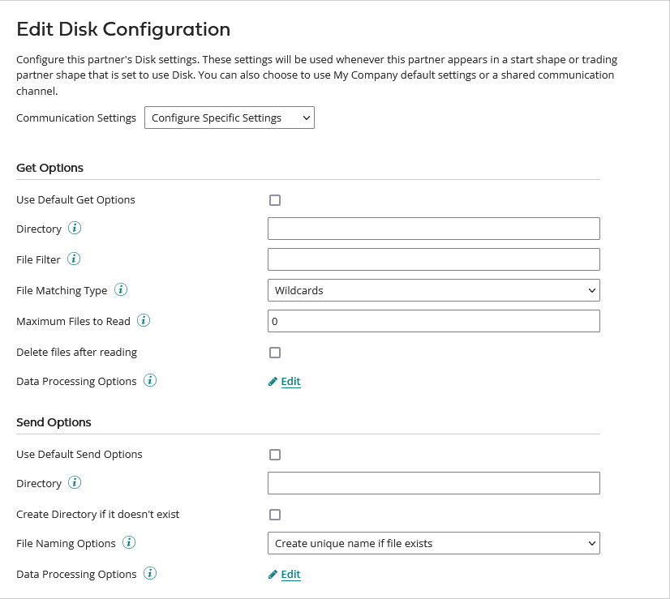

# Disk Communication Method configuration 

<head>
  <meta name="guidename" content="Integration"/>
  <meta name="context" content="GUID-b895a3f5-c313-4447-bf76-3a28260a82fa"/>
</head>

To set up Disk as a communication method for a trading partner, you can use default settings, shared communication, or manually configure specific settings in the Edit Disk Communication dialog. The dialog opens from within the trading partner **Communication** tab when you add Disk as a communication method or click **Disk** in the Communication Method list.

## Get Options 

**Name**  
**Description**

**Use Default Get Options**  
If selected, the settings in this section are not visible; this partner uses the settings configured for whichever My Company that it is paired with on a Start or Trading Partner step.

**Directory**  
The directory to which the data is read or written:

 -   The path can be local (e.g. `C:\\TEMP** or **/tmp/`), a UNC path (e.g. `\\\\server1\\share`), or an NFS path (e.g. `/home/Boomi`).
 -   The path can be absolute (full path from the operating system's root directory) or relative to the Atom installation directory (`..\\Boomi AtomSphere\\Atom — <Atom_name\>` by default).

 -   In Windows, you can use forward slashes or backslashes for directories (**C:\\Temp** and **C:/Temp**).

**File Filter**  
 Reads files conditionally based on a pattern that matches the file name.

**File Matching Type**    
You can filter for matching files using the following methods:

 -   Wildcards use the simple file filters \* and ? characters to determine if a file should be read. The \* represents multiple characters. The ? represents a single character. To read all files that end with the extension .txt, enter \*.txt.
-   Regular Expressions are a more powerful matching option than wildcards and can include complex regular expressions.

**Maximum Files to Read**  
Sets the maximum number of files to read at one time. 0, the default value, reads all matching files in directory.

**Delete files after reading**  
If selected, files are deleted after reading them into the process. If deletion is unsuccessful due to insufficient access rights, a warning message is logged.

The recommended practice is turning off this field when testing and turning on this field in production to prevent data from being processed twice.

**Data Processing Options**  
Add, edit, delete, or reorder the data processing steps after receiving the data and before decrypting the data. For more information, see the [Data Process step](/docs/Atomsphere/Integration/Process%20building/r-atm-Data_Process_shape_8d7ca2b4-b8a7-4820-a8fe-c85dedb12b5c.md) help topic.

## Send Options 

**Name**  
**Description**

**Use Default Send Options**  
If selected, the settings in this section are not visible; this partner uses the settings configured for whichever My Company that it is paired with on a Start or Trading Partner step.

**Directory**  
The directory to which the data is written or read. The path can be local (e.g. `C:\\TEMP or /tmp/`), a UNC path (e.g. `\\\\server1\\share`), or an NFS path (e.g. `/home/Boomi`).

**Create Directory if it doesn’t exist**  
 If selected, the specified directory is created if it does not exist rather than aborting.

**File Naming Options**  
An incremental number is attached to the file until a file name is found that does not exist. For example, if output.txt is being written and it exists, then output1.txt is attempted, then output2.txt, and so on until a file is not found.

**Data Processing Options**  
The data processing steps are completed in the order specified before the data is sent.