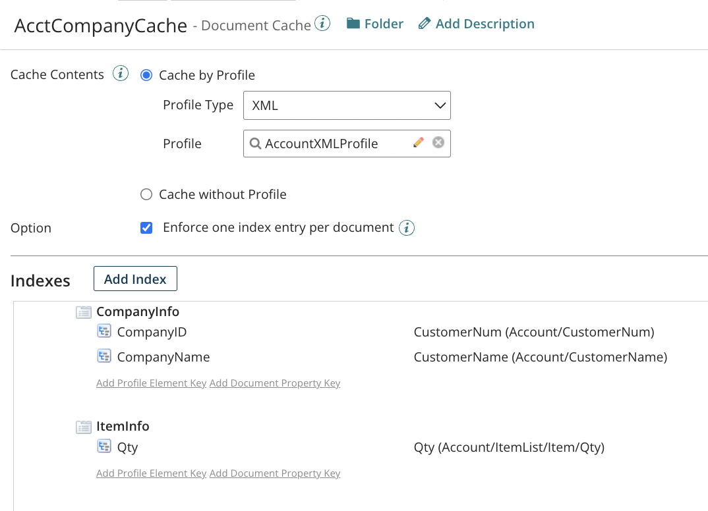

# Document cache configuration and usage

<head>
  <meta name="guidename" content="Integration"/>
  <meta name="context" content="GUID-5d1dd62f-8c06-4aa8-b47f-d0bc49b9e923"/>
</head>

To use document caching, you must create a Document Cache component. You can use the Document Cache component to select documents based on a particular profile type and profile or to select documents that are not of a certain profile type, such as a binary file.

-   To cache documents based on a profile, select one of the following profile types: Database, EDI, flat file, XML or JSON. Then select a profile.

-   To cache documents that are not of a certain profile type, select a Cache Contents of “Cache without Profile”.

Next add indexes and keys.

-   An *index* is a grouping of related keys. Indexes are used to organize keys. To be valid, each Document Cache component must have at least one index and each index must have at least one key.

-   *Keys* must be defined for the primary fields that link the data set to the source systems.

    -   If you are using profiles, each key that you create corresponds to an element in the source profile, or to a document property, dynamic document property, or MIME property in the source document.

    -   If you are not using profiles, each key that you create corresponds to a document property, dynamic document property, or MIME property in the source document.

    -   Documents that contain these elements, document properties, dynamic document properties, or MIME properties and that have parameter values will be added to the document cache.

    -   When you use a document cache later, in mapping for example, keys are used to pull data out of the documents in the cache.

In the following sample Document Cache component, an XML profile is used to select the documents. There are two indexes: CompanyInfo and ItemInfo. Two company-related keys are in the CompanyInfo index. One quantity-related key is in the ItemInfo index. All of the keys are mapped to elements in the AccountXMLProfile profile.

When this Document Cache component is used by the Add to Cache step, the three keys are used to retrieve those values to load into the indexes. If any key values in the source documents are null or empty, the Add to Cache step fails and you receive an error.

The **Enforce one index entry per document** option ensures that each cached document produces at most one index entry \(that is, only one key is associated with each document\). If you clear this option, you will not be able to perform the following actions when you use this Document Cache component in a process:

-   Retrieve all documents from the document cache.
-   Remove specific documents from the document cache by index name.
- The cache does not filter out duplicates, you need to do that beforehand. Use the enforce unique options in a flat file and mapping or manually remove duplicates.

After creating a Document Cache component, you can use it in the following places within a process:

-   Add to Cache step

-   Retrieve From Cache step

-   Remove From Cache step

-   Data Process step

-   Parameter values

-   Connector operations \(on the Caching tab\)

-   Maps to join multiple source documents \(only document caches based on a profile type and profile\)

-   Maps in a lookup function \(only document caches based on a profile type and profile\).

You can also use Document Cache components in subprocesses. For example, your process can call a subprocess that adds documents to the cache.

:::note

Document caching and the Document Cache component are included in the Advanced Workflow. For more information, contact your Boomi account representative.

:::