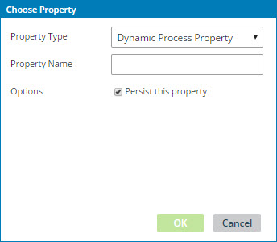

# Dynamic Process Properties

<head>
  <meta name="guidename" content="Integration"/>
  <meta name="context" content="GUID-3fe48a7a-039a-49b2-866f-60c9532c1ff9"/>
</head>

Process properties are name/value pairs that you can use to store arbitrary information to assist with your integration. One type of process property, a dynamic process property, is a single, on-the-fly property that you create. 

To retrieve a dynamic process property, you must remember its name and type it in the field, function, or script that you are using.  

:::note

If you have user-defined dynamic process properties, you can continue to use them or you can replace them with process property components. If you have never used dynamic process properties, you should use process property components instead. Process property components are more powerful and easier to work with.

:::

Dynamic process properties are in the Choose Property dialog.

**Name**   
**Description**

**Property Name**   
Sets a descriptive name for the property. The name appears in the Extensions dialogs.

**Options**   

**Name**   
**Description**

**Persist this property**   
If selected, the property value is persisted across subsequent executions. See the topic about process property persistence for more information.

Important things to know about dynamic process properties:

-   Set and retrieve exactly the same name. Using a naming convention, such as all caps with underscores for spaces, increases matches and reduces typos.

-   Names are case-sensitive.

-   Values are stored as characters. If you store numeric or date-type values, you may need to cast or reformat them when retrieving or mapping. If you will use other data types, process property components are easier to use because you can select the data type.

-   You can set an unlimited number of dynamic process properties.

-   It is a good practice to use unique names when setting up dynamic process properties in different processes. This is especially important to persist properties or if you use the properties in extensions. If you use extensions and if you have created multiple dynamic process properties with the same name, only one instance of that property name is displayed in the Extensions dialog. Therefore you cannot set multiple values for multiple dynamic process properties with the same name. If you set an extension value, it will apply to all processes that use that dynamic process property name. Having unique names simplifies maintenance and reduces the chance of inadvertently referencing or overwriting the wrong property.