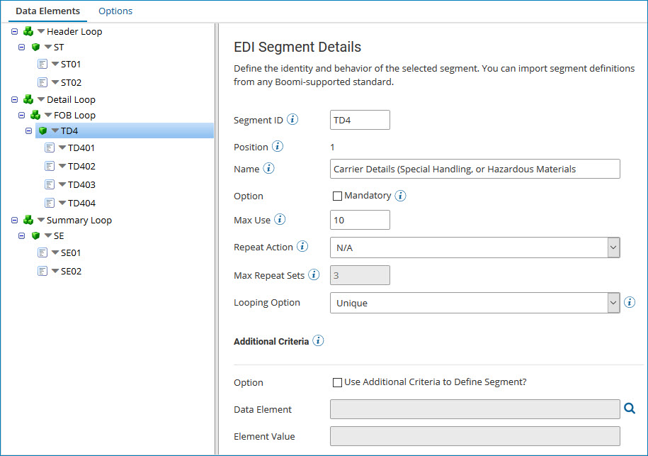

# EDI profile's Data Elements tab

<head>
  <meta name="guidename" content="Integration"/>
  <meta name="context" content="GUID-486114cd-6edc-4e03-8cd6-9717150eade2"/>
</head>

Use the EDI Profile's Data Elements tab to manually build or choose segments and/or data elements that define the field structure of the EDI document to process.

Before adding segments and data elements, go to the Options tab and select an EDI standard and options. To create an X12, HL7, or EDIFACT EDI profile, additionally select a version to import. If you are creating an HL7 profile, additionally select both the version and the message type. Then, if you are creating an X12, HL7, EDIFACT, Tradacoms, or ODETTE EDI profile, select the transmission type — either an X12 transaction set, an HL7 transmission type, or an EDIFACT, Tradacoms, or ODETTE message type — and select pre-configured segments and data elements. Based on the looping section you are constructing, the segment\(s\) are added to the appropriate section loop. If you are creating a user-defined EDI profile, build the segments and data elements manually.

All segments for a specific transaction type can be classified as a Header, Detail, or Summary segment. Refer to your EDI specifications to understand how to organize your segment order.

See the linked topic about working with EDI profiles to learn how to import, add, delete, and reorder segments, loops, and data elements in an EDI profile.