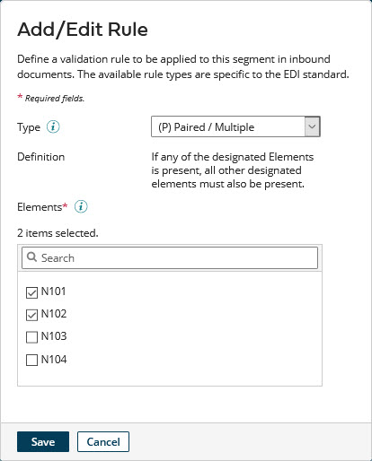

# EDI profile’s Data Elements tab, segment details

<head>
  <meta name="guidename" content="Integration"/>
  <meta name="context" content="GUID-bdb62c13-3f90-46b6-875f-6e4220a29805"/>
</head>

When you select a segment in the tree, you can view or edit the segment's details.

- **Segment ID** - The segment ID used to read or generate a group of related elements. This ID appears in the tree.

  :::note

  The segment ID is always used to populate the segment in Map step output. It is therefore not possible in a map to add a default value to a segment in a destination EDI profile.

  :::

- **Position** - Number that indicates the segment's location in relation to its parent. If you move the segment to a different location its position number changes.

- **Name** - A reference name that describes the purpose of the segment.

- **Mandatory** - If selected, the presence of the segment is validated when reading or writing data.

- **Max Use** - For any loop, the Maximum Usage field is defined within the given EDI standard specification as the maximum number of times a given segment may appear within the given loop. This field is pre-populated when defining a standard-based document and may be altered by the designer based upon a given requirement. This field is used to detect error conditions when interpreting or generating the associated document.

  :::note

  The maximum number of times a segement may appear in a loop is not enforced. If **Max Use** is greater than 1, multiple occurances of the segment are allowed.

  :::

- **Repeat Action** - Used to define instructions to execute upon the occurrence of repeating data when reading or writing the associated segment in the context of a data map. The options are:

  - N/A
  - Concatenate when Reading
  - Repeat when Writing
  - Break repeated sets when reading
  - Combine repeated sets when writing

- **Max Repeat Sets** - Used to define how many repeated sets may occur within a single segment. Used with the data element's Set Repeat Type field.

- **Looping Option** - Used when writing EDI loops or segments.

  - Unique means only unique instances of a loop or segment is written. If two \(or more\) loops or segments are identical, then only the first instance is written.
  - Occurrence means all instances are written.

## Additional Criteria

Instance Identifiers are normally used when there are multiple occurrences of a segment within a document, such as date segments with different qualified values. However, when segments repoeat in specific locations in a document, as in HL segments in an X12 856 document, you can add extra defining information in this section to control looping.

- **Use Additional Criteria to Define Segment** - If selected, the source EDI data has specific identifiers on the segment level. Instance Identifiers are normally used when there are multiple occurrences of a segment within a document \(for example. date segments with different qualified values\). However, when segments repeat in specific locations in a document, as in HL segments in an X12 856 document, you can add extra defining information here to control looping.

- **Data Element** - Used to select a unique sub-element.

- **Element Value** - Used to specify a text value.

## Validation Rules

Validation rules are applied to the segment in documents. For each rule, the table shows the Type, Definition, and the elements that are evaluated when the rule is applied. Clicking **Add Rule** opens the Add/Edit Rule dialog for the purpose of adding a rule. Clicking a type in a table row opens the Add/Edit Rule dialog for the purpose of editing the rule. Clicking **Remove ** initiates a request to remove the rule from the segment. This action requires confirmation.

When segments are imported into an X12 EDI profile, rules defined in the X12 standard for the selected version of the standard are automatically added to the imported segments.

:::note

The Validation Rules table is visible here and rules are applied to documents only while **Segment Validation Rules** is selected in the profile’s **Options** tab.

:::

Existing rule definitions are retained while **Segment Validation Rules** is cleared.

:::note

Currently it is possible to add rules only to segments in an X12, EDIFACT, or ODETTE EDI profile.

:::

In the Add/Edit Rule dialog:

- **Type** - Selects the rule type. The rule types available for selection are specific to the profile’s selected EDI standard.

  These rule types are applicable to X12:

  - \(P\) Paired/Multiple — if any of the selected **Elements** is present in a document, all other selected **Elements** must also be present. A rule of this type is meaningful only if multiple elements are selected.
  - \(R\) Required — at least one of the selected **Elements** must be present in a document.
  - \(E\) Exclusion — one and only one of the selected **Elements** can be present in a document.
  - \(C\) Conditional — if the **Conditional Element** is present in a document, all of the selected **Elements** must also be present.
  - \(L\) List Conditional — if the **Conditional Element** is present in a document, at least one of the selected **Elements** must also be present.

  These rule types are applicable to EDIFACT and ODETTE.

  - \(D1\) One and Only One — one and only one of the selected **Elements** can be present in a document.
  - \(D2\) All or None — if any of the selected **Elements** is present in a document, all other selected **Elements** must also be present. A rule of this type is meaningful only if multiple elements are selected.
  - \(D3\) One or More — at least one of the selected **Elements** must be present in a document.
  - \(D4\) One or None — one or none of the selected **Elements** can be present in a document.
  - \(D5\) If First Then All — if the **Conditional Element** is present in a document, all of the selected **Elements** must also be present.
  - \(D6\) If First, Then At Least One More — if the **Conditional Element** is present in a document, at least one of the selected **Elements** must also be present.
  - \(D7\) If First, Then None of the Others — if the **Conditional Element** is present in a document, none of the selected **Elements** can also be present.

:::note

The parenthetical codes listed above — for example, \(D1\) — are specific to EDIFACT and thus do not appear in the **Type** selection list for an ODETTE profile.

:::

- **Conditional Element** - Selects the element whose presence or absence in a document is initially evaluated when the rule is applied.

  - For a rule in an X12 profile, this list is present only while the selected **Type** is “\(C\) Conditional” or “\(L\) List Conditional”.
  - For a rule in an EDIFACT profile, this list is present only while the selected **Type** is “\(D5\) If First Then All”, “\(D6\) If First, Then At Least One More”, or “\(D7\) If First, Then None of the Others”.
  - For a rule in an ODETTE profile, this list is present only while the selected **Type** is “If First Then All”, “If First, Then At Least One More”, or “If First, Then None of the Others”.

  Selecting an element removes the element from the **Elements** list.

- **Definition** - Shows the rule definition.

- **Elements** - In this list of the segment’s elements, selecting the check box adjacent to an element designates that element as one that is evaluated or additionally evaluated when the rule is applied. You can use the search field to filter the element list.

  Selecting an element removes it from the **Conditional Element** list if that list is visible.
