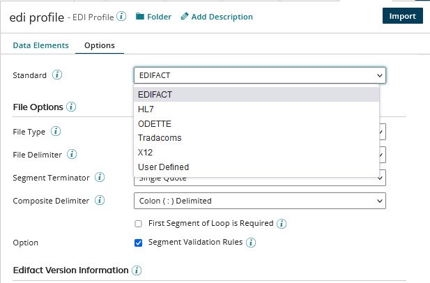
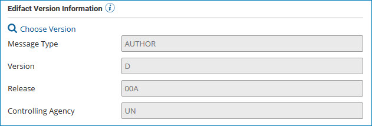
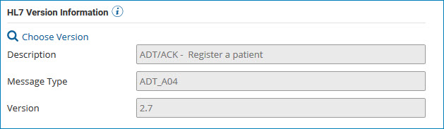
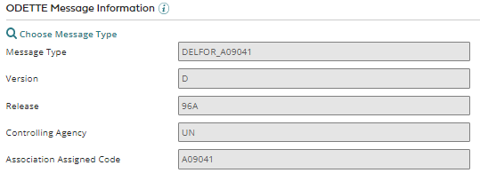
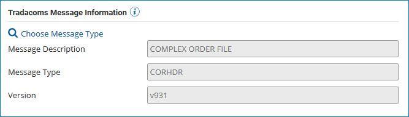
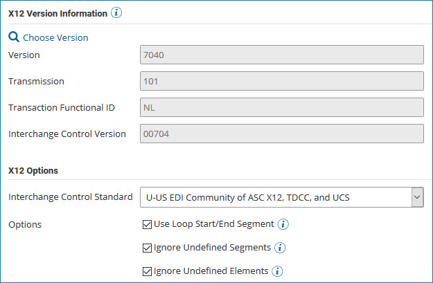

# EDI profile’s Options tab

<head>
  <meta name="guidename" content="Integration"/>
  <meta name="context" content="GUID-6261e4ab-3523-482c-807e-89c033f8fc19"/>
</head>

In the EDI profile's Options tab, configure options for the type of EDI transaction you are integrating.

**Standard** - Selects the standard for the transaction type. The following selections are available:

- EDIFACT — an international standard that was developed by the United Nations to provide syntax rules, an interactive exchange protocol, and a set of standard messages so that countries and industries can exchange electronic business documents.

- HL7 — a standard for facilitating interoperability of health information technology. HL7 supports clinical practice and the management, delivery, and evaluation of health services.

- ODETTE — a standard based on EDIFACT, is primarily used in the European automotive sector.

- Tradacoms — a standard primarily used in the UK retail sector.

- X12 — a standard primarily used for EDI, defines specific standards for many EDI document types and subsets, which serve particular vertical markets.

- User Defined — select in order to create a custom EDI document profile.

## File Options

In the File Options section, which is nearly identical for each EDI standard, specify formatting details that control how documents are read or written.

Delimiters and terminator segments can be either of two character types:

- Byte Character — Sets the delimiter to the formatted byte character typed in the adjacent field. For example, 0XFF. The format should be parsable by the method described in this [Oracle doc](https://docs.oracle.com/javase/7/docs/api/java/lang/Integer.html#decode(java.lang.String)).

- Other Character — Sets the delimiter to the character typed in the adjacent field.

When you select a standard, sections with additional settings open. Those sections are described below.

These are the common File Options settings:

- **File Type** - Specify the file type as delimited or data positioned:

  - Delimited — data elements are separated by a specific character.
  - Data Positioned — data elements are defined by a start column number and character length.

- **Pad Character** - (Available if Data Positioned is the selected **File Type**) The character to use to pad empty spaces.

- **File Delimiter** - (Available if Delimited is the selected **File Type**) The character to use to delimit elements.

- **Segment Terminator** - (Available if Delimited is the selected **File Type**) The character ending each segment.

- **Composite Delimiter** - (Available if Delimited is the selected **File Type**) The character to use to delimit components of a composite element.

- **Sub-Composite Delimiter** - (Available if HL7 is the selected **Standard** and Delimited is the selected **File Type**) The character to use to delimit sub-composite items.

- **Repeat Delimiter** - (Available if HL7 is the selected **Standard** and **Enhanced Composites** is enabled) The delimiter separating repeating data elements.

- **Enhanced Composites** - (Available if HL7 is the selected **Standard**) If enabled, composite data elements are displayed in a hierarchical tree structure. Refer to [Using enhanced composites](./int-Using_enhanced_composites.md) for more information.

- **Disable Escape** - (Available if HL7 is the selected **Standard** and **Enhanced Composites** is enabled) Determines whether special character escaping is applied for reading and writing data elements at a global profile level. If disabled, you can modify escaping at the element level. Refer to [Using enhanced composites](./int-Using_enhanced_composites.md) for more information.

- **First Segment of Loop is Required** - (Available if EDIFACT is the selected **Standard**) If selected, when a document is read, the first segment in a loop must be present if the **Mandatory** option for that segment is selected.

- **Segment Validation Rules** - (Available if X12 or EDIFACT is the selected **Standard**) If selected, validation rules for individual segments can be defined in the **Data Elements** tab, and defined rules are applied to the segments in documents. If cleared, defined rules are not applied, but their definitions are retained.

:::note

When segments are imported into an EDI profile for which X12 is the selected **Standard**, rules defined in the standard for the selected **Version** are automatically added to the imported segments.

:::

## EDIFACT version information

\(Available only if EDIFACT is the selected **Standard**\) This section is used to set options for the EDIFACT message type associated with this profile. You can choose and import a message type to select the pre-configured segments and data elements to include.

- **Choose Version** - Opens the Select Transmission dialog in which you select the EDIFACT message type to integrate. Message types are version-specific.

  In the Select Transmission dialog, select the EDIFACT **Version** from the list. Then select the message type as the **Transmission** and click **Save**.

  The **Version** and **Transmission** selected here are automatically selected in the import wizard, which is used to import pre-configured segments and data elements for the message type. If the automatic selections are changed in the wizard, upon completion of the import, the selections here update to reflect the message type used for the import.

  The following EDIFACT versions are available for selection:

  | | | | |
  | --- | --- | --- | --- |
  | D00A | D00B | D01A | D01B | D01C |
  | D02A | D02B | D03A | D03B | D04A |
  | D04B | D05A | D05B | D06A | D06B |
  | D07A | D07B | D08A | D08B | D09A |
  | D09B | D10A | D10B | D11A | D11B |
  | D12A | D12B | D13A | D13B | D14A |
  | D14B | D15A | D15B | D16A | D16B |
  | D17A | D90.2| D91.1| D91.2| D92.1|
  | D93.2| D93A | D94A | D94B | D95A |
  | D95B | D96A | D96B | D97A | D97B |
  | D98A | D98B | D99A | D99B |      |

- **Message Type** - Displays the name of the selected message type.

- **Version** - Displays the version of the selected message type.

- **Release** - Displays the EDIFACT release number.

- **Controlling Agency** - Displays the name of the agency that defined the message type and version.

## HL7 version information

\(Available only if HL7 is the selected **Standard**\) This section is used to set options for the HL7 transmission type associated with this profile. You can choose and import a transmission type to select the pre-configured segments and data elements to include.

- **Choose Version** - Opens the Select Transmission dialog in which you select the HL7 transmission type to integrate. Transmission types are both version-specific and message type-specific.

  In the Select Transmission dialog, select the HL7 **Version** from the list and the message **Type** from the next list. Then select the **Transmission** type and click **Save**. If the **Save** button is inactive, the selected type is unavailable.

  The **Version**, **Type**, and **Transmission** selected here are automatically selected in the import wizard, which is used to import pre-configured segments and data elements for the transmission type. If the automatic selections are changed in the wizard, upon completion of the import, the selections here update to reflect the transmission type used for the import.

  The following HL7 versions are available for selection:

  - 2.1
  - 2.2
  - 2.3
  - 2.31
  - 2.4
  - 2.5
  - 2.51
  - 2.6
  - 2.7

- **Description** - Displays the description of the transmission type selected in the Select Transmission dialog.

- **Message Type** - Displays the transmission type selected in the Select Transmission dialog.

- **Version** - Displays the version selected in the Select Transmission dialog.

## ODETTE Message Information

\(Available only if ODETTE is the selected **Standard**\) This section is used to set options for the ODETTE message type associated with this profile. You can choose and import a message type to select the pre-configured segments and data elements to include.

- **Choose Message Type** - Opens the Select Transmission dialog in which you select the ODETTE message type to integrate.

  In the Select Transmission dialog, select the message type as the **Transmission** and click **Save**.

  The **Transmission** selected here is automatically selected in the import wizard, which is used to import pre-configured segments and data elements for the message type. If the automatic selection is changed in the wizard, upon completion of the import, the selection here updates to reflect the message type used for the import.

- **Message Type** - Displays the name of the selected Message Type and the Association Assigned Code, separated by an underscore.

- **Version** - Displays the version of the selected Message Type.

- **Release** - Displays the ODETTE release number.

- **Controlling Agency** - Displays the name of the agency that defined the message type and version.

- **Association Assigned Code** - Displays the ODETTE Association Assigned Code.

## Tradacoms Message Information

\(Available only if Tradacoms is the selected **Standard**\) This section is used to set options for the Tradacoms message type associated with this profile. You can choose and import a message type to select the pre-configured segments and data elements to include.

- **Choose Message Type** - Opens the Select Transmission dialog in which you select the Tradacoms message type to integrate.

  In the Select Transmission dialog, select the message type as the **Transmission** and click **Save**.

  The **Transmission** selected here is automatically selected in the import wizard, which is used to import pre-configured segments and data elements for the message type. If the automatic selection is changed in the wizard, upon completion of the import, the selection here updates to reflect the message type used for the import.

- **Message Description** - Displays the description of the selected Message Type.

- **Message Type** - Displays the name of the selected Message Type.

- **Version** - Displays the version of the selected Message Type.

## X12 version information and options

\(Available only if X12 is the selected **Standard**\) This section is used to set options for the X12 transaction set associated with this profile. You can choose and import a transaction set to select the pre-configured segments and data elements to include.

### X12 Version Information

- **Choose Version** - Opens the Select Transmission dialog in which you select the X12 transaction set to integrate. Transaction sets are version-specific.

  In the Select Transmission dialog, select the X12 **Version** from the list. Then select the transaction set as the **Transmission** and click **Save**.

  The **Version** and **Transmission** selected here are automatically selected in the import wizard, which is used to import pre-configured segments and data elements for the transaction set. If the automatic selections are changed in the wizard, upon completion of the import, the selections here update to reflect the transaction set used for the import.

  The following X12 versions are available for selection:

  | | | | |
  | --- | --- | --- | --- | --- |
  | 2001 | 2002      | 2003 | 2040      | 3010 |
  | 3020 | 3030      | 3040 | 3050      | 3060 |
  | 3070 | 4010      | 4020 | 4030      | 4040 |
  | 4050 | 4060      | 5010 | 5010 HIPAA| 5020 |
  | 5030 | 5040      | 5050 | 6010      | 6020 |
  | 6030 | 6040      | 6050 | 7010      | 7020 |
  | 7030 | 7040      | 7050 | 7060      | 8010 |

- **Version** - Displays the selected X12 version number.

- **Transmission** - Displays the ID of the selected transaction set.

- **Transaction Functional ID** - Displays the selected transaction set's functional group ID.

- **Interchange Control Version** - Displays the version number of the interchange control segments.

### X12 Options

- **Interchange Control Standard** - Configures the control standard defined in your X12 EDI specifications.

  - U-US EDI Community of ASC X12, TDCC and UCS
  - X-US EDI Community of ASC X12

The following check boxes are features of a previous integration platform version \(version 3.x\). They are listed for legacy support.

- **Use Loop Start/End Segment** - If selected, loop start and loop end segments are added before and after every loop. This is not needed in most cases.

- **Ignore Undefined Segments** - If selected, undefined segments are ignored and an error condition is not generated.

- **Ignore Undefined Elements** - If selected, undefined elements are ignored and an error condition is not generated.
