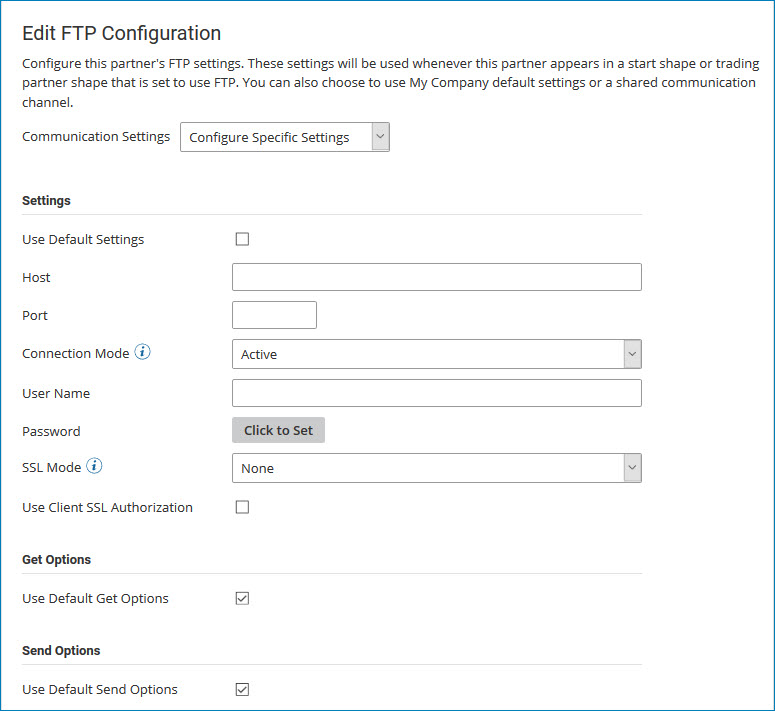
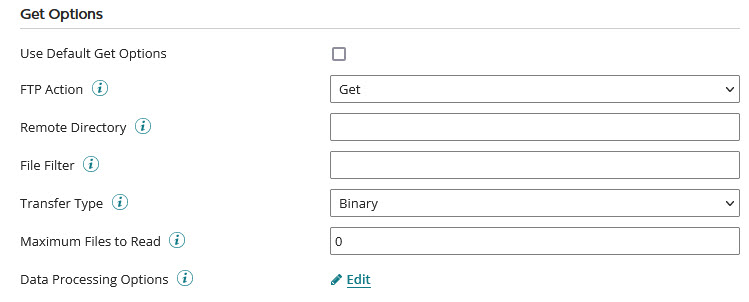
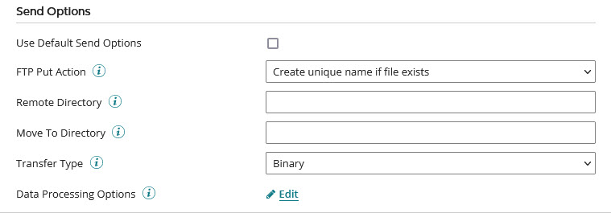

# FTP Communication Method configuration 

<head>
  <meta name="guidename" content="Integration"/>
  <meta name="context" content="GUID-351fcdf9-ded6-42d9-82a0-e2733248d413"/>
</head>

To set up FTP as a communication method for a trading partner, you can use default settings, shared communication, or manually configure specific settings in the Edit FTP Configuration dialog. The dialog opens from within the trading partner **Communication** tab when you add FTP as a communication method or click **FTP** in the Communication Method list.

## Settings 

**Name**  
**Description**

**Use Default Settings**  
If selected, the settings in this section are not visible; this partner uses the settings configured for whichever My Company that it is paired with on a Start or Trading Partner step.

**Host**  
The host name or IP address or the domain name of the FTP server to connect to. The FTP server is where the FTP application resides.

**Port**  
The port on which the FTP Server will listen for incoming connections from an FTP client. The default port is 21.

**Connection Mode**  
Ensure that the connection mode matches the corresponding setting on the FTP server.

**User Name**  
The user name of the account on the FTP server.

**Password**  
The password of the account on the FTP server.

**SSL Mode**    
With implicit and explicit SSL, the data connection is always fully encrypted:

   -   None — SSL encryption is not used.
-   Implicit — Negotiation is not supported with implicit configurations and a Transport Layer Security must be established at the beginning of the connection.

 -   Explicit — Standard FTP protocol commands and replies are used for the connection, typically on the standard port 21, then the client sends a command to switch to SSL mode.

Ensure that the connection mode matches the corresponding setting on the FTP server.

**Use Client SSL Authorization**    
Select if you are using a client SSL certificate.

**Client SSL Certificate**   
Ensure that the connection mode matches the corresponding setting on the FTP server.

## Get Options 

**Name**  
 **Description**

**Use Default Get Options**  
If selected, the settings in this section are not visible; this partner uses the settings configured for whichever My Company that it is paired with on a Start or Trading Partner step.

**FTP Action**    
The FTP actions are:

-   Get — Retrieve but do *not* delete file\(s\) from the server.

 -   Get and Delete — Retrieve *and* delete file\(s\) from the server. recommends this action for executing in production mode to prevent the same file from being processed twice.

**Remote Directory**  
The directory on the FTP server from which files are read. If no Move To Directory is specified, data is left in the remote directory.

**File Filter**  
Reads files conditionally based on a pattern that matches the file name. Use the wildcard characters \* and ? to create file name patterns.

**Transfer Type**  
Transfer files as raw data or as text.

**Maximum Files to Read**  
Sets the maximum number of files to read at one time. The default value, 0, reads all matching files in the directory.

**Data Processing Options**  
The data processing steps are completed in the order specified after receiving the data before the data is decrypted. For more information, see the Data Process step help topic.

## Send Options 

**Name**  
**Description**

**Use Default Send Options**  
If selected, the settings in this section are not visible; this partner uses the settings configured for whichever My Company that it is paired with on a Start or Trading Partner step.

**FTP Put Action**  
Sets what the Communication Channel should do after getting an FTP file and finding that a file with that name already exists:

-   Create unique name if file exists — keeps the old file and adds the new file with a different name.
  -   Append if file exists — keeps the old file and adds the new data to the end of it.

 -   Error if file exists — keeps the old file without appending or replacing it or adding a new file.

 -   Overwrite if file exists — replaces the old file with the new file.

**Remote Directory**  
Directory on the FTP server to which data is uploaded. If the Move To Directory is not specified, the data is left in the remote directory.

**Move To Directory**  
The directory into which the data moves after it is successfully uploaded. recommends that you use this if another application is retrieving files from the Move To Directory. The files are first written to the Remote Directory to avoid the risk that an application might read the files before the upload is completed. After the files are successfully uploaded, they are moved into the Move To Directory.

**Transfer Type**  
Transfer files as raw data or as text.

**Data Processing Options**  
The data processing steps are completed in the order specified after receiving the data before the data is decrypted. For more information, see the Data Process step help topic.