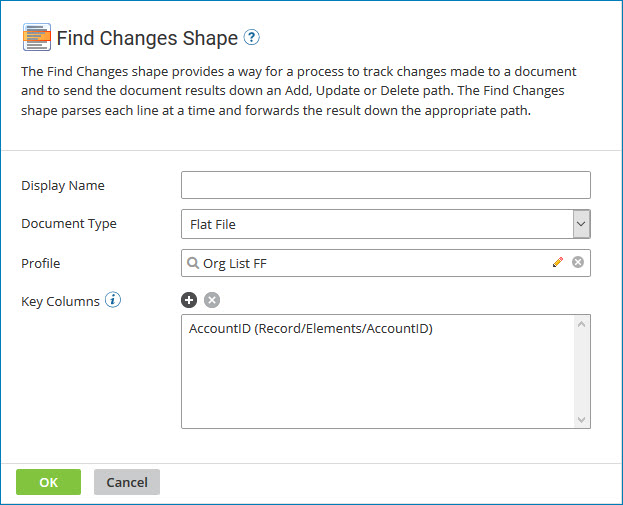

# Find Changes step

<head>
  <meta name="guidename" content="Integration"/>
  <meta name="context" content="GUID-C0E876C8-4366-4878-931B-D31D56D97E19"/>
</head>

The Find Changes step provides a way for a process to track changes made to a document and to send the document results down an Add, Update or Delete path.

:::note

This step is part of the Advanced Workflow and is available only in the Professional, Professional Plus, Enterprise, and Enterprise Plus Editions of Integration. Contact your Boomi account representative for more information.

:::

The Find Changes step is most useful for large data sets or mainframe files where a full capture of the data always needs to be retrieved from the source system. An alternate process design should be considered if you can simply retrieve the modified data per process execution because it is naturally more efficient.

This step parses each line at a time and forwards the result down the appropriate path. The first execution of a process with this step sends all results down the Add path. Subsequent executions use this first document as the basis for comparison, and added or updated data is stored per execution. After the Add path, the Update and then Delete paths are executed sequentially.

:::note

If a document reaching this step does not contain a full capture of your desired comparison set, the process assumes that the missing records should be *deleted*. The process sends the missing instances down the Delete path.

:::

If you are using a local Atom and you are testing the Find Changes step in a process, you need to reset the step before deploying the process to production. To reset the Find Changes step within a specific process, delete the process’ files from the `<atom_installation_directory>/work/cdc/<component_ID_of_process>` directory.

## Find Changes step dialog

**Name**   
**Description**

**Display Name**   
\(Optional\) User-defined name to describe the step. If one is not entered, “Find Changes” appears on the step.

**Profile Type**   
The document type that represents the data structure you would like to track.

**Profile**   
Lookup definition for the Profile component.

**Key Columns**   
Profile element definition for the primary column\(s\) of each record. If more than one key column is required, ensure that these columns are not subject to change so records are routed successfully.

:::note

If a key column is invalid, it is highlighted in the Key Columns field. A key column may become invalid if it was deleted from the selected profile, or if it was replaced with a new key column of the same name but differing key value numbers. Remove the invalid key column and re-add it as needed to rectify the issue.

:::