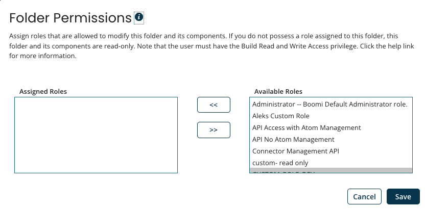

# Folder Permissions dialog

<head>
  <meta name="guidename" content="Integration"/>
  <meta name="context" content="GUID-421F756C-AB0B-49B1-9AEF-5CB8EA63AC33"/>
</head>

The Folder Permissions dialog is used by administrators to assign user roles to and remove user roles from the selected folder.

Users assigned roles for a folder have write access to that folder and the components in that folder. The users must also have the Build Read and Write Access privilege. For more information about write restrictions on folders, see the Component Explorer topics.

Users who are not administrators can open any folder’s Folder Permissions dialog to see which roles are assigned to the folder.

- **Assigned Roles** - Lists the user role\(s\) that can modify the selected folder and the components in the folder.

- **Available Roles** \(visible only to administrators\) - Lists roles that are not already assigned to the selected folder. Administrators can select from the available roles and custom roles that exist in the account.

- **Add selected roles** button \(visible only to administrators\) - Used by administrators to add roles to the list of roles that have write access to the selected folder.

- **Remove selected roles** button \(visible only to administrators\) - Used by administrators to remove roles from the list of roles that have write access to the selected folder.

:::note

A newly created folder inherits the permissions of its parent.

:::

:::note

Each user assigned the role must also have the Build Read and Write Access privilege. This privilege ensures that they can design, build, and modify processes and components on the Build page.

:::

For example, an account has a Boomi project. There are two teams working on the project: Team A and Team B. The teams share some connector components, so they store them in the Boomi Project folder, which has no write restrictions on it. The components that only Team A can change are stored in the Team A folder, which has the Team A custom role applied to it. The components that only Team B can change are stored in the Team B folder, which has the Team B custom role applied to it. Tom, who is a member of Team B, sees the following in the Component Explorer:

The Boomi Project folder has no write restrictions on it, therefore it has a regular folder icon next to it. Tom has full access to it and to its connector components. The Team A folder icon has a gray lock on it because Tom does not have write access to it. He can, however, see the folder and the components in it. The Team A Pennsylvania sub-folder icon also has a gray lock on it because Tom does not have write access to it. The Team A Texas sub-folder has no write restrictions on it, therefore it has a regular folder icon next to it and Tom has full access to it. The Team B folder and Team B California folder icons have a blue person on them because Tom has write access to both folders.