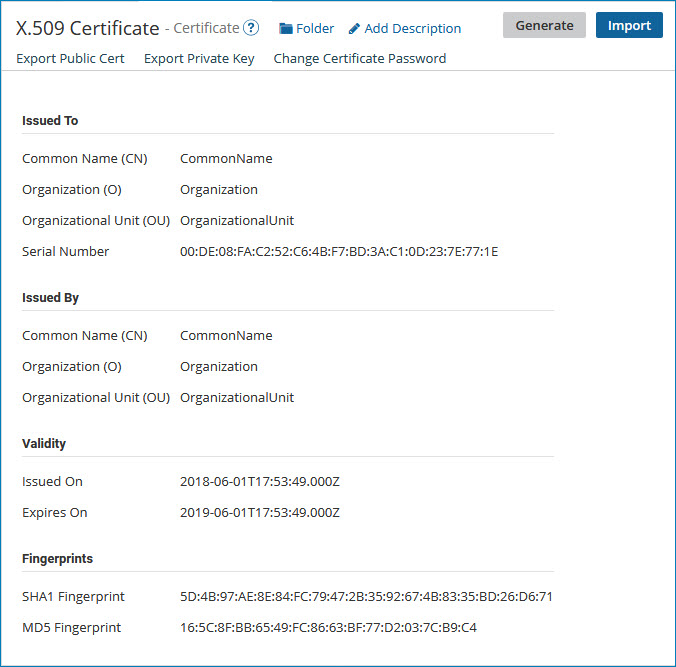

# Generate Private Key wizard 

<head>
  <meta name="guidename" content="Integration"/>
  <meta name="context" content="GUID-95c9c0e0-40a7-444f-9291-9aeee11e41d7"/>
</head>

When you create a private X.509 certificate and generate a private key for it, you must enter information about the certificate using the Generate Private Key wizard. That information is then stored in the certificate.

**X.509 Name**  
**Description**

**Common Name \(CN\)**  
Free-form description

**Organization \(O\)**  
 Free-form description

**Organizational Unit \(OU\)**  
 Free-form description

**Locality \(L\)**  
City

**State/Province \(ST\)**  
State abbreviation

**Country \(C\)**  
Country abbreviation; US = United States

**Password**  
Click **Click to Set**, enter the password, and click **Apply**.

**Signature Algorithm**  
 Selects the cryptographic Secured Hash Algorithm \(SHA\) used to generate the digital signature for the key. These are the available selections:

 -   SHA2-512 — 512-bit hash function using 64-bit words \(default\)

 -   SHA2-384 — 384-bit hash function using 64-bit words

 -   SHA2-256 — 256-bit hash function using 32-bit words

  -   SHA2-224 — 224-bit hash function using 32-bit words. This algorithm is not fully supported by some versions of Windows.

  -   SHA1 — 160-bit hash function. This algorithm is no longer approved for most cryptographic uses.

**Key Length**  
Selects the length, in bits, of the generated key. These are the available selections:

  -   2048 \(default\)

  -   1024

**Validity \(in days\)**  
365 \(default\)

When you create a PGP certificate and generate a private key for it, you must enter the following information, which is stored in the private certificate:

**PGP Name**  
**Description**

**Identity**  
 Free-form description

**Pass Phrase**  
boomi
 
**Key Algorithm**  
Selects the algorithm used to generate the key. These are the available selections:

-   DSA — Digital Signature Algorithm \(default\)

-   RSA — enables generation of an encrypted key

**Key Length**  
Selects the length, in bits, of the generated key. These are the available selections:

 -   4096 \(available only if **Key Algorithm** is set to RSA, in which case this selection is the default\)

 -   2048 \(available only if **Key Algorithm** is set to RSA\)

 -   1024 \(this is the only available selection if **Key Algorithm** is set to DSA\)

