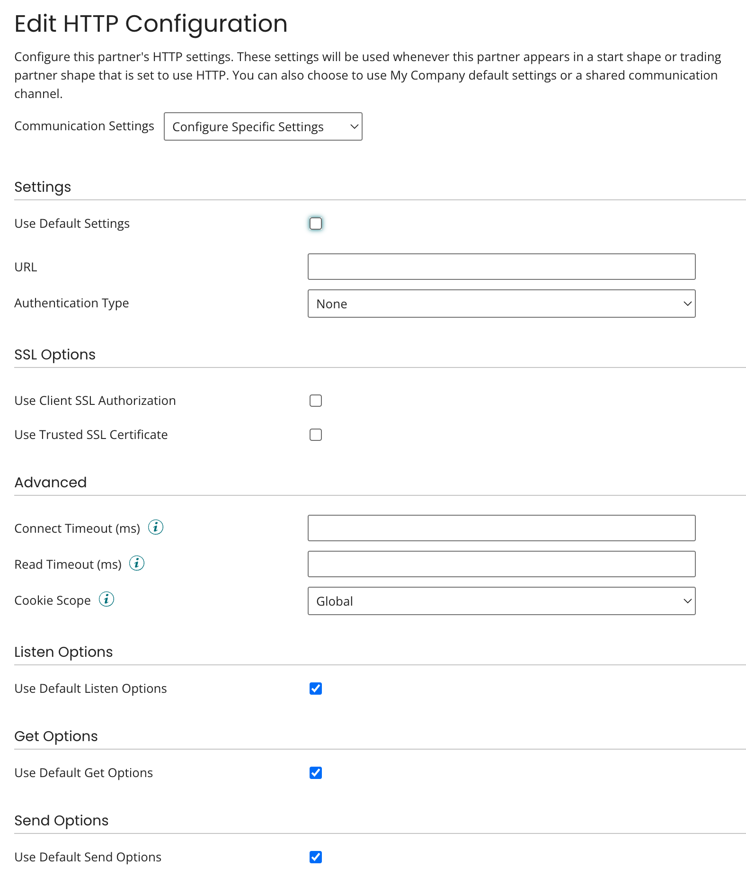
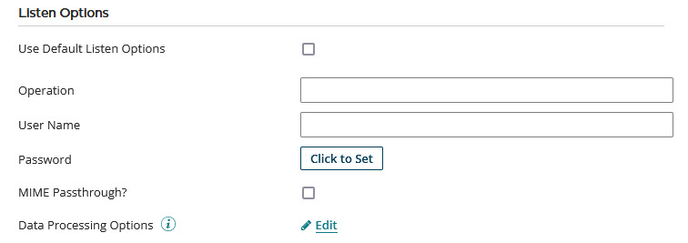
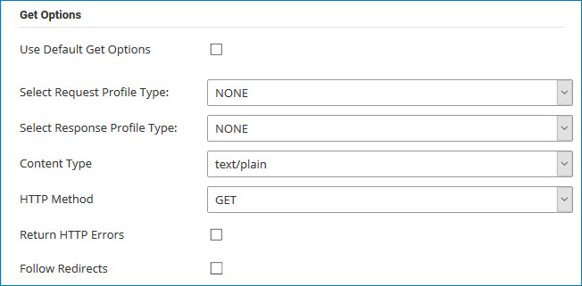
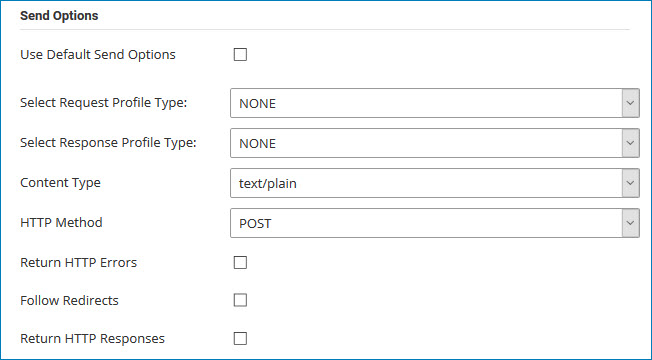

# HTTP Communication Method configuration 

<head>
  <meta name="guidename" content="Integration"/>
  <meta name="context" content="GUID-9cc1115f-bebb-4280-ad66-f83e52e45093"/>
</head>

To set up HTTP as a communication method for a trading partner, you can use default settings, shared communication, or manually configure specific settings in the Edit HTTP Configuration dialog. The dialog opens from within the trading partner **Communication** tab when you add HTTP as a communication method or click **HTTP** in the Communication Method list.

## Settings

Settings in this section are extensible.

**Name**  
**Description**

**Use Default Settings**  
If selected, the settings in this section and the SSL Options and Advanced sections are not visible; this partner uses the settings configured for whichever My Company that it is paired with on a Start or Trading Partner step.

**Authentication Type**  
Identifies the secure sign in type:

 -   None
 -   Basic — Upon selection of this type the **User** and **Password** fields are revealed. Basic authentication is not secure. User passwords are not encrypted and the target server is not authenticated.

   -   Password Digest — Upon selection of this type the **User** and **Password** fields are revealed. HTTP digest authentication is more secure than basic authentication as it uses a two-step process that encrypts credentials by applying a hash function to the username, the password, a server-supplied nonce value, the HTTP method, and the requested URI.

-   Custom — Upon selection of this type the **User** and **Password** fields are revealed. This setting automatically replaces any header or resource path replacement variable named "password" or "username" with the respective values from this security section. This is a base URL to which the operation can add via the resource path.

 -   OAuth — Upon selection of this type, the OAuth settings section is revealed.

 -   OAuth 2.0 — Upon selection of this type, the OAuth 2.0 settings section is revealed.

**User**  
The user name for authentication if **Authentication Type** is set to Basic, Password Digest, or Custom.

**Password**    
The password for authentication if **Authentication Type** is set to Basic, Password Digest, or Custom.

## OAuth 

supports OAuth authorization for versions 1.0 and 1.0a for both on-premise and cloud integrations. See the OAuth settings section in the HTTP Client connection topic. OAuth settings are extensible.

## OAuth 2.0 

supports OAuth 2.0 authorization for on-premise and cloud-based integrations. OAuth 2.0 is not backwards compatible with OAuth 1.0 or 1.0a. You must edit account permissions to use OAuth 2.0 authentication with your cloud application *if you use custom policy files*. See the OAuth 2.0 settings section in the HTTP Client connection topic. OAuth 2.0 settings are extensible.

## SSL Options 

Settings in this section are extensible.

**Name**  
**Description**

## Advanced 

Settings in this section are extensible.

**Name**  
**Description**

## Listen Options 

Settings in this section are extensible.

If the user name and password credentials have been used by another HTTP Trading Partner listener process, enter different credentials.

**Name**  
**Description**

**Use Default Listen Options**  
If selected, the settings in this section are not visible; this partner uses the settings configured for whichever My Company that it is paired with on a Start or Trading Partner step.
 
**Operation**  
The URL path that you are listening to such as b2b/operationname.

**User Name**  
The user name for basic authentication. This setting is required.

**Password**  
The password for basic authentication. This setting is required.

**Data Processing Options**  
Click on **Edit** to view or edit the **Data Process Properties**. For more information, see Data Process step.

## Get Options 

Settings in this section are *not* extensible.

**Name**   
**Description**

**Use Default Get Options**   
If selected, the settings in this section are not visible; this partner uses the settings configured for whichever My Company that it is paired with on a Start or Trading Partner step.

**Data Processing Options**  
 Click on **Edit** to view or edit the **Data Process Properties**. For more information, see Data Process step.

## Send Options 

Settings in this section are *not* extensible.

**Name**    
**Description**

**Use Default Send Options**  
If selected, the settings in this section are not visible; this partner uses the settings configured for whichever My Company that it is paired with on a Start or Trading Partner step.

**Data Processing Options**  
Click on **Edit** to view or edit the **Data Process Properties**. For more information, see Data Process step.