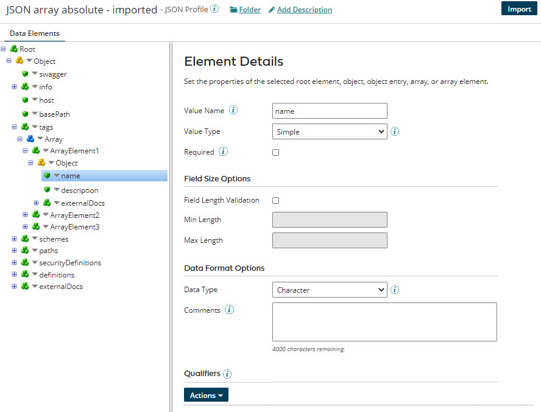

# JSON profile’s Data Elements tab

<head>
  <meta name="guidename" content="Integration"/>
  <meta name="context" content="GUID-e5dd8565-b399-46d6-8209-f111d3626721"/>
</head>

View and modify a JSON profile’s data structure in a tree view.

The JSON profile's **Data Elements** tab displays the structure of the JSON document in a tree structure. Every JSON profile has exactly one root element. All other elements are contained within this single root element. Elements can be *nested* within another element to establish parent/child relationships.

The icons in the tree structure on the **Data Elements** tab represent the following:

-    A root element, object entry or array element with child elements

-    An element without child elements

-    An object with child elements

-    An array with child elements

If you select an element, object, or array in the tree on the left, its settings appear on the right.

On the JSON profile's Data Elements tab you define the root element and its value type: Simple, Array \(Repeating\), Array \(Absolute\) or Object. The value type that you select determines whether you can add arrays, array elements, objects, object entries and/or instance identifiers. Use the Import Wizard to quickly create or update a JSON profile by importing data elements, objects or arrays from a JSON document.

:::note

Uploaded or imported files pass through a virus scanner first. If the scan detects a virus, you receive an error message, and the scan rejects the file. If an error persists, contact Boomi Support.

:::

Root elements, arrays, array elements, objects and object entries in a JSON profile have the following configuration settings.

## General Options

**Name**   
**Description**

**Value, Object or Array Name**   
Name of the selected root element, object, object entry, array or array element. Only object entry names must match the actual JSON name in the source or destination file. The other names are arbitrary names that you use in your business.

Array elements in an absolute array must have unique names.

**Value Type**   
Used to select a JSON data type for the selected root element, object entry or array element. The options are:

-   Simple — Used for a value.

-   Array \(Repeating\) — Used for an array that contains a repeating element. Instance identifiers can be used with repeating arrays.

-   Array \(Absolute\) — Used for an array that contains a set of different elements, rather than a repeating element.

-   Object — Used for an unordered set of name/value pairs.

**Looping Option**  
This option is available only for the root element.  
- Unique — Only unique instances of a loop or segment will be written. If two (or more) loops or segments are identical, then only the first instance is written.  
- Occurrence — All instances are written.

**Required**   
\(absolute array elements only\) If the array element is being written, then any attributes of that array element marked as required are written out, even if the attribute is not mapped and/or contains no data.

When a required list is specified in an imported JSON schema file, the **Required** field is automatically turned on in the user interface for those array elements listed as required.

These settings determine how repeating array elements are handled in a JSON profile. Essentially, these settings are used to control how data is output when mapping to the profile.

**Name**   
**Description**

**Min Occurs \(Minimum Occurrences\)**   
The minimum number of times the element can occur.

When `minItems` is set to a number greater than 0 in an imported JSON schema file, the JSON profile in the user interface translates the **Min Occurs** field to `1`. Otherwise, the default is 0.

For example, if the JSON schema SwaggerStringArray.json specifies "minItems" : 2, the profile in the user interface translates this as **Min Occurs** = `1`.

When the **Required** option is turned on for an array field, **Min Occurs** is automatically set to `1`. When turned off, **Min Occurs** is set to `0`.

Max Occurs \(Maximum Occurrences\)   
The maximum number of times the element can occur.

When `maxItems` in the JSON schema file is set to a number greater than 1, the JSON profile in the user interface translates the **Max Occurs** to `1`. Otherwise, the default is `unbounded`.

For example, if the imported JSON schema specifies "maxItems" : 1, the JSON profile in the user interface translates **Max Occurs** to `1`. If the imported JSON schema specifies "maxItems" : 12, the JSON profile sets **Max Occurs** to `-1(unbounded)`.

Here are some tips for using the Min/Max Occurs settings:

-   For an optional element, set Min Occurs=0 and Max Occurs=1.

-   For a mandatory element, set Min Occurs=1 and Max Occurs=1.

## Field Size Options

If a root element, object entry or array element’s value type is set to Simple, then you can set the following field size options.

**Name**   
**Description**

**Field Length Validation**   
Determines whether data validation during runtime should occur on this root element, object entry or array element \(mandatory, length, etc.\).

**Minimum Length**   
Defines the minimum allowable length of the root element, object entry or array element's value.

The **Minimum Length** field is automatically configured in the Data Elements tab, if `minLength` is specified in the JSON schema file. The **Field Length Validation** field is turned on by default when Minimum Length is populated in a JSON profile created via connector browsing or an API Service.

**Maximum Length**   
Defines the maximum allowable length of the root element, object entry or array element's value.

The **Maximum Length** field is automatically configured in the Data Elements tab, if `maxLength` is specified in the JSON schema file. The **Field Length Validation** field is not turned on by default when Maximum Length is populated.

The **Maximum Length** field is automatically configured in the Data Elements tab, if `maxLength` is specified in the JSON schema file. The **Field Length Validation** field is turned on by default when Maximum Length is populated in a JSON profile created via connector browsing or an API Service.

## Data Format Options

If a root element, object entry or array element’s value type is set to Simple, you can set the following data type and format options:

**Name**   
**Description**

**Data Type**   
Data type of the root element, object entry or array element. The available choices are Boolean, Character \(default\), Number, and Date/Time. Selection of Boolean, Number, or Date/Time may be necessary to satisfy an integration requirement.

**Number Format**   
\(Number **Data Type** only\) A standard Java number formatting string specifying the format for the value.

**Signed**   
\(Number **Data Type** only\) If selected, a byte in the value indicates whether the value is positive or negative.

**Implied Decimals**   
\(Number **Data Type** only\) Often in fixed-length legacy files, numeric values do not have decimal points so the decimal precision can be determined only by an assumed number of decimal digits. The effect of this setting in a process on a given value is dependent upon the context in which the profile that contains the data element is used.

**Date Format**   
\(Date/Time **Data Type** only\) The date/time format for the value. You can either type the format or select an existing one.

When a JSON profile is created via connector browsing or API Service and the JSON schema an attribute’s format is “date-time”, “date”, or “time”, the resulting profile element is configured as a Date/Time type with a respective Date Format in the user interface.

**Comments**   
Optionally add details about the use of the selected element. The Comments field is automatically populated from an imported JSON schema Description attribute, if it is already specified through connector browsing or the API Service's Import external service file. Comments can be manually added after the initial JSON import.

:::note

Comments that are longer than 4,000 characters are truncated in the user interface.

:::

For more information about formatting Number and Date elements, see [Number data type](r-atm-Number_data_type_25bd3c61-4613-42cb-9282-b16756fa47fa.md) and [Date/Time data type](r-atm-DateTime_data_type_05826c0b-8b49-4d8f-94a5-9ce7c15d64d0.md) topics.

## Qualifiers

Text qualifiers can be added to a root element, object entry, or array element if its **Value Type** is set to Simple. Qualifiers identify values that can be used in instance identifiers. For each qualifier, the table shows the Value and Description. Clicking a value opens the Edit Qualifier dialog, which is used to edit the **Value** and **Description**.

The check boxes in the table are used with the **Remove Selected** and **Remove All** actions — see below. Clicking **Remove ** initiates a request to remove the qualifier from the element. This action requires confirmation.

The **Actions** menu items are as follows:

-   **Add** — opens the Add Qualifier dialog, which is used to add a qualifier value to the element. **Value** is required. A **Description** can optionally be included in the qualifier definition.

-   **Remove Selected** — initiates a request to remove selected qualifiers from the element. In the confirmation dialog, clicking **OK** executes the request; clicking **Cancel** cancels the request.

-   **Remove All** — initiates a request to remove all qualifiers from the element. In the confirmation dialog, clicking **OK** executes the request; clicking **Cancel** cancels the request.