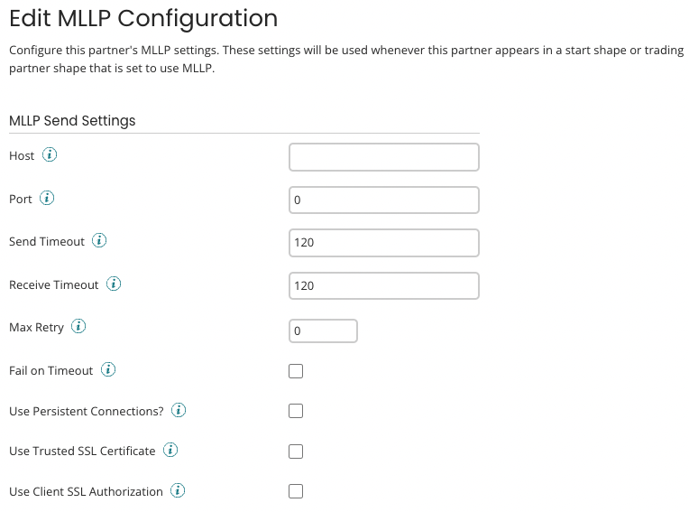

# MLLP Communication Method configuration

<head>
  <meta name="guidename" content="Integration"/>
  <meta name="context" content="GUID-efcf53f8-07c5-4a5a-a23e-8e66435ea03a"/>
</head>

To set up MLLP as a communication method for an HL7 or X12 trading partner, use the Edit MLLP Configuration dialog. The dialog opens from within the trading partner **Communication** tab when you add MLLP as a communication method or click **MLLP** in the Communication Method list.

## MLLP Send Settings

- **Host** - The host of the trading partner’s listening MLLP server.

- **Port** - The port of the trading partner’s listening MLLP server.

- **Send Timeout** - Sets the number of seconds before the connection times out waiting for the completion of a Send operation. This setting is pre-set to 120 seconds.

- **Receive Timeout** -  Sets the number of seconds before the connection times out waiting for an HL7 ACK message or X12 TA1/997/999 message from the receiving MLLP server. The preset is 120 seconds. This setting has no effect if **Require Accept Acknowledgements** is set to Never for the HL7 standard.

- **Max Retry** - Sets the number of times the connector retries a Send operation that is timing out.

- **Fail on Timeout** - If selected, sending processes fail when an acknowledgment timeout exception occurs. Selecting this option has the intended effect only if, in the trading partner’s **HL7 Standard** tab, **Require Accept Acknowledgements** is set to Always, Errors Only, or Successes Only.

- **Use Persistent Connections?** - If selected, the connection is added to the connection pool and can be reused. Reveals the **Max Pool Size** and **Expire Timeout** fields.

  - **Max Pool Size** - The maximum number of connections that can exist at one time in the connection pool.

  - **Expire Timeout** - The number of seconds that an inactive connection can remain in the pool before it is closed and removed from the pool.

- **Use Trusted SSL Certificate** - If selected, the connection uses SSL/TLS to connect to the server. Reveals the **Trust SSL Server Certificate** field.

  - **Trust SSL Server Certificate** - Select the SSL Server Certificate from the drop-down list to establish an SSL/TLS connection.

- **Use Client SSL Authorization** - If selected, the connection uses Client SSL authorization. Reveals the **Client SSL Certificate** field.

  - **Client SSL Certificate** - Select the Client SSL Certificate from the drop-down list for authorization.

    :::note

    When using Client Certificate authentication with the Shared Web Server, certificates should always be unique.

    :::
